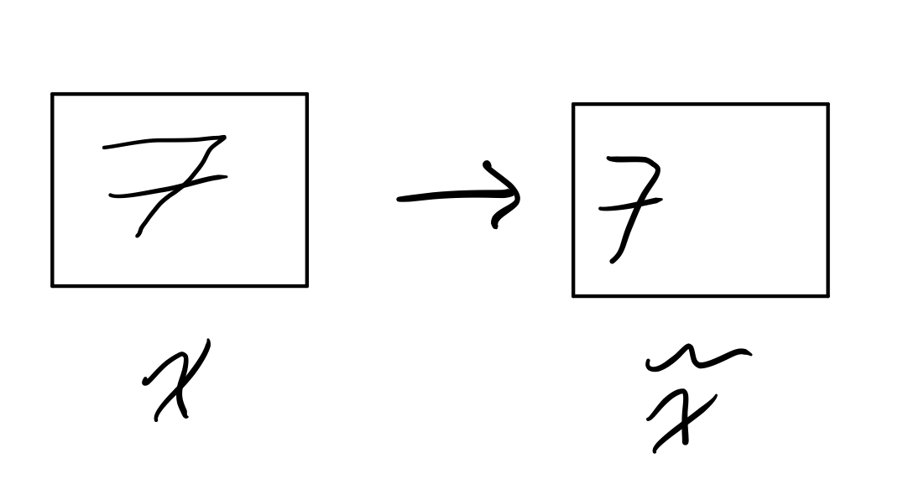

# Week 10:  Stochastic Variational Inference

### Assigned Reading

- Murphy: Chapter 18

### Overview

- Review Variational Inference
- Derive the variational objective
- ELBO intuition
- Stochastic optimization

## Posterior Inference for Latent Variable Models

Imagine we had the following latent variable model

which represents the probabilistic model \(p(x z ; \theta)\) where

- \(x_{1:N}\) are the observations
- \(z_{1:N}\) are the unobserved local latent variables
- \(\theta\) are the global latent variables (i.e. the parameters)

The conditional distribution of the unobserved variables given the observed variables (the posterior inference) is

\[
p(z, \theta | x) = \frac{p(x | z, \theta)}{p(x)} = \frac{p(x | z, \theta)}{\int\int p(x, z, \theta)d_zd_{\theta}}
\]

which we will denote as \(p_{\theta}(z | x)\).

Because the computation \(\int\int p(x, z, \theta)d_zd_{\theta}\) is intractable, making the computation of the conditional distribution itself intractable, we must turn to variational methods.

### Approximating the Posterior Inference with Variational Methods

Approximation of the posterior inference with variational methods works as follows:

1. Introduce a variational family, \(q_\phi(z | x)\) with parameters \(\phi\).
2. Encode some notion of "distance" between \(p_\theta\) and \(q_\phi\).
3. Minimize this distance.

This process effectively turns Bayesian Inference into an optimization problem (and we _love_ optimization problems in machine learning).

It is important to note that whatever function we choose for \(q_\phi\), it is unlikely that our variational family will have the true distribution \(p_\theta\) in it.

#### Kullback-Leibler Divergence

We will measure the distance between \(q_\phi\) and \(p_\theta\) using the [**Kullback-Leibler divergence**](https://en.wikipedia.org/wiki/Kullback%E2%80%93Leibler_divergence).

!!! note
    Kullback–Leibler divergence has lots of names, we will stick to _"KL divergence"_.

We compute \(D_{KL}\) as follows:

\begin{align}
  D_{KL}(q_\phi(z | x) || p_\theta(z | x)) &= \int q_\phi(z | x) \log \frac{q_\phi(z | x)}{p_\theta(z | x)}dz \\
  &= E_{z \sim q_\phi} \log \frac{q_\phi(z | x)}{p_\theta(z | x)}
\end{align}

##### Properties of the KL Divergence

1. \(D_{KL}(q_\phi || p_\theta) \ge 0\)
2. \(D_{KL}(q_\phi || p_\theta) = 0 \Leftrightarrow q_\phi = p_\theta\)
3. \(D_{KL}(q_\phi || p_\theta) \not = D_{KL}(p_\theta || q_\phi)\)

The significance of the last property is that \(D_{KL}\) is _not_ a true distance measure.

### Variational Objective

We want to approximate \(p_\theta\) by finding a \(q_\phi\) such that

\[
q_\phi \approx p_\theta \Rightarrow D_{KL}(q_\phi || p_\theta) \Rightarrow 0
\]

but the computation of \(D_{KL}(q_\phi || p_\theta)\) is intractable (as discussed above).

!!! note
    \(D_{KL}(q_\phi || p_\theta)\) is intractable because it contains the term \(p_\theta(z | x)\), which we have already established, is intractable.

To circumvent this issue of intractability, we will derive the [**evidence lower bound (ELBO)**](https://en.wikipedia.org/wiki/Evidence_lower_bound), and show that maximizing the ELBO \(\Rightarrow\) minimizing \(D_{KL}(q_\phi || p_\theta)\).

\begin{align}
  D_{KL}(q_\phi || p_\theta) &= E_{z \sim q_\phi} \log \frac{q_\phi(z | x)}{p_\theta(z | x)} \\
  &= E_{z \sim q_\phi} \Bigg [ \log \Bigg ( q_\phi(z | x) \cdot \frac{p_\theta(x)}{p_\theta(z, x)} \Bigg ) \Bigg ] \\
  &= E_{z \sim q_\phi} \log \frac{q_\phi(z | x)}{p_\theta(z, x)}  + E_{z \sim q_\phi} \log p_\theta(x) \\
  &= -L(x ; \phi)  + \log p_\theta(x) \\
\end{align}

Where \(L(x ; \theta)\) is the **ELBO**.

!!! note
    Notice that \(\log p_\theta(x)\) is _not_ dependent on \(z\).

Rearranging, we get

\begin{align}
  D_{KL}(q_\phi || p_\theta) &= -L(x ; \phi)  + \log p_\theta(x) \\
  \Rightarrow L(x ; \phi) + D_{KL}(q_\phi || p_\theta) &= \log p_\theta(x) \\
\end{align}

Because \(D_{KL}(q_\phi || p_\theta) \ge 0\)

\[
L(x ; \phi) \le \log p_\theta(x)
\]

\(\therefore\) maximizing the ELBO \(\Rightarrow\) minimizing \(D_{KL}(q_\phi || p_\theta)\).

#### Alternative Derivation

Starting with [**Jenson's inequality**](https://en.wikipedia.org/wiki/Jensen%27s_inequality),

\[
f(E[X]) \le E[f(x)]
\]

if \(X\) is a random variable and \(f\) is a convex function.

Given that \(\log\) is a concave function, we have

\begin{align}
\log p(x) &= \log \int p_\theta(x, z)dz \\
&= \log \int p_\theta(x, z) \frac{q_\phi(z | x)}{q_\phi(z | x)} dz \\
&= \log E_{z \sim q_\phi} \frac{p_\theta(x, z)}{q_\phi(z | x)} \\
\Rightarrow  \log E_{z \sim q_\phi} \frac{p_\theta(x, z)}{q_\phi(z | x)} & \ge E_{z \sim q_\phi} \log \frac{p_\theta(x, z)}{q_\phi(z | x)} \\  
&= - E_{z \sim q_\phi} \log \frac{p_\theta(x, z)}{q_\phi(z | x)} \\
\end{align}
