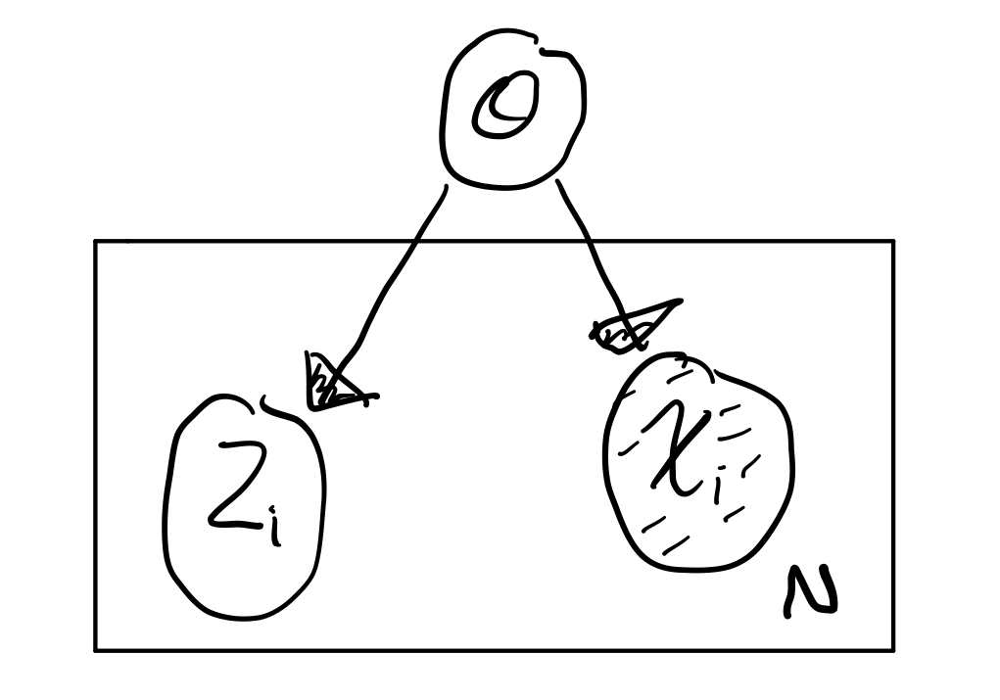
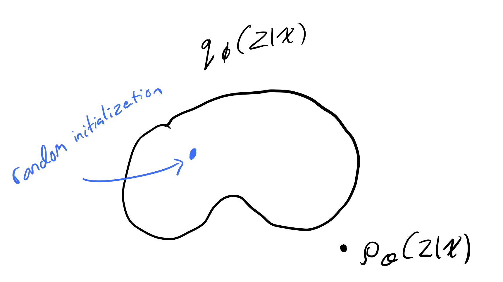
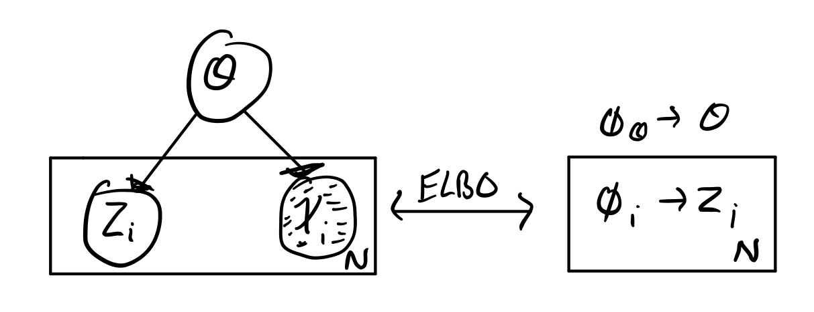

# Week 10: Stochastic Variational Inference / Automatic Differentiation Variation Inference (SAD VI)

### Assigned Reading

- Murphy: Chapter 18

### Overview

- Review Variational Inference
- Derive the variational objective
- ELBO intuition
- Stochastic optimization

## Posterior Inference for Latent Variable Models

Imagine we had the following [latent variable model](https://en.wikipedia.org/wiki/Latent_variable_model)

which represents the probabilistic model \(p(x, z ; \theta)\) where

- \(x_{1:N}\) are the observations
- \(z_{1:N}\) are the unobserved local latent variables
- \(\theta\) are the global latent variables (i.e. the parameters)

The conditional distribution of the unobserved variables given the observed variables (the posterior inference) is

\[
p(z, \theta | x) = \frac{p(x | z, \theta)}{p(x)} = \frac{p(x | z, \theta)}{\int\int p(x, z, \theta)d_zd_{\theta}}
\]

which we will denote as \(p_{\theta}(z | x)\).

Because the computation \(\int\int p(x, z, \theta)d_zd_{\theta}\) is intractable, making the computation of the conditional distribution itself intractable, we must turn to variational methods.

### Approximating the Posterior Inference with Variational Methods

Approximation of the posterior inference with variational methods works as follows:

1. Introduce a variational family, \(q_\phi(z | x)\) with parameters \(\phi\).
2. Encode some notion of "distance" between \(p_\theta\) and \(q_\phi\).
3. Minimize this distance.

This process effectively turns Bayesian Inference into an optimization problem (and we _love_ optimization problems in machine learning).

It is important to note that whatever function we choose for \(q_\phi\), it is unlikely that our variational family will have the true distribution \(p_\theta\) in it.

#### Kullback-Leibler Divergence

We will measure the distance between \(q_\phi\) and \(p_\theta\) using the [**Kullback-Leibler divergence**](https://en.wikipedia.org/wiki/Kullback%E2%80%93Leibler_divergence).

!!! note
    Kullback–Leibler divergence has lots of names, we will stick to _"KL divergence"_.

We compute \(D_{KL}\) as follows:

\begin{align}
  D_{KL}(q_\phi(z | x) || p_\theta(z | x)) &= \int q_\phi(z | x) \log \frac{q_\phi(z | x)}{p_\theta(z | x)}dz \\
  &= \underset{z \sim q_\phi}{\operatorname{\mathbb{E}}} \log \frac{q_\phi(z | x)}{p_\theta(z | x)}
\end{align}

##### Properties of the KL Divergence

1. \(D_{KL}(q_\phi || p_\theta) \ge 0\)
2. \(D_{KL}(q_\phi || p_\theta) = 0 \Leftrightarrow q_\phi = p_\theta\)
3. \(D_{KL}(q_\phi || p_\theta) \not = D_{KL}(p_\theta || q_\phi)\)

The significance of the last property is that \(D_{KL}\) is _not_ a true distance measure.

### Variational Objective

We want to approximate \(p_\theta\) by finding a \(q_\phi\) such that

\[
q_\phi \approx p_\theta \Rightarrow D_{KL}(q_\phi || p_\theta) = 0
\]

but the computation of \(D_{KL}(q_\phi || p_\theta)\) is intractable (as discussed above).

!!! note
    \(D_{KL}(q_\phi || p_\theta)\) is intractable because it contains the term \(p_\theta(z | x)\), which we have already established, is intractable.

To circumvent this issue of intractability, we will derive the [**evidence lower bound (ELBO)**](https://en.wikipedia.org/wiki/Evidence_lower_bound), and show that maximizing the ELBO \(\Rightarrow\) minimizing \(D_{KL}(q_\phi || p_\theta)\).

\begin{align}
  D_{KL}(q_\phi (z | x) || p_\theta (z | x)) &= \underset{z \sim q_\phi}{\operatorname{\mathbb{E}}} \log \frac{q_\phi(z | x)}{p_\theta(z | x)} \\
  &= \underset{z \sim q_\phi}{\operatorname{\mathbb{E}}} \Bigg [ \log \Bigg ( q_\phi(z | x) \cdot \frac{p_\theta(x)}{p_\theta(z, x)} \Bigg ) \Bigg ] \\
  &= \underset{z \sim q_\phi}{\operatorname{\mathbb{E}}} \log \frac{q_\phi(z | x)}{p_\theta(z, x)}  + \underset{z \sim q_\phi}{\operatorname{\mathbb{E}}} \log p_\theta(x) \\
  &= -\mathcal L(\theta, \phi ; x)  + \log p_\theta(x) \\
\end{align}

Where \(\mathcal L(\theta, \phi ; x)\) is the **ELBO**.

!!! note
    Notice that \(\log p_\theta(x)\) is _not_ dependent on \(z\).

Rearranging, we get

\begin{align}
  D_{KL}(q_\phi (z | x) || p_\theta (z | x)) &= -\mathcal L(\theta, \phi ; x)  + \log p_\theta(x) \\
  \Rightarrow \mathcal L(\theta, \phi ; x) + D_{KL}(q_\phi (z | x) || p_\theta (z | x)) &= \log p_\theta(x) \\
\end{align}

Because \(D_{KL}(q_\phi (z | x) || p_\theta (z | x)) \ge 0\)

\[
\mathcal L(\theta, \phi ; x) \le \log p_\theta(x)
\]

\(\therefore\) maximizing the ELBO \(\Rightarrow\) minimizing \(D_{KL}(q_\phi (z | x) || p_\theta (z | x))\).

#### Alternative Derivation

Starting with [**Jenson's inequality**](https://en.wikipedia.org/wiki/Jensen%27s_inequality),

\[
f(E[X]) \le E[f(x)]
\]

if \(X\) is a random variable and \(f\) is a convex function.

Given that \(\log\) is a concave function, we have

\begin{align}
\log p(x) &= \log \int p_\theta(x, z)dz \\
&= \log \int p_\theta(x, z) \frac{q_\phi(z | x)}{q_\phi(z | x)} dz \\
&= \log \underset{z \sim q_\phi}{\operatorname{\mathbb{E}}} \frac{p_\theta(x, z)}{q_\phi(z | x)} \\
\Rightarrow  \log \underset{z \sim q_\phi}{\operatorname{\mathbb{E}}} \frac{p_\theta(x, z)}{q_\phi(z | x)} & \ge \underset{z \sim q_\phi}{\operatorname{\mathbb{E}}} \log \frac{p_\theta(x, z)}{q_\phi(z | x)} \\  
&= - \underset{z \sim q_\phi}{\operatorname{\mathbb{E}}} \log \frac{q_\phi(z | x)}{p_\theta(x, z)} \\
&= \mathcal L(\theta, \phi ; x)
\end{align}

### Alternative Forms of ELBO and Intuitions

We have that

\[
\mathcal L(\theta, \phi ; x) = \text{ELBO} = - \underset{z \sim q_\phi}{\operatorname{\mathbb{E}}} \log \frac{q_\phi(z | x)}{p_\theta(x, z)}
\]

1) The most general interpretation of the ELBO is given by

\begin{align}
  \mathcal L(\theta, \phi ; x) &= - \underset{z \sim q_\phi}{\operatorname{\mathbb{E}}} \log \frac{q_\phi(z | x)}{p_\theta(x, z)} \\
  &= \underset{z \sim q_\phi}{\operatorname{\mathbb{E}}} \log \frac{p_\theta(x, z)}{q_\phi(z | x)} \\
  &= \underset{z \sim q_\phi}{\operatorname{\mathbb{E}}} \log \frac{p_\theta(z)p_\theta(x | z)}{q_\phi(z | x)} \\
  &= \underset{z \sim q_\phi}{\operatorname{\mathbb{E}}} \Big [ \log p_\theta({x | z}) + \log p_\theta({z}) - \log {q_\phi(z | x)} \Big ]\\
\end{align}

2) We can also re-write 1) using entropy

\[
\underset{z \sim q_\phi}{\operatorname{\mathbb{E}}} \Big [ \log p_\theta({x | z}) + \log p_\theta({z}) \Big ] \mathbb{H} \Big [ q_\phi(z | x) \Big ] \\
\]

3) Another re-write and we arrive at

\[
\underset{z \sim q_\phi}{\operatorname{\mathbb{E}}} \Big [ \log p_\theta({x | z}) \Big ] - D_{KL}(q_\phi(z | x) || p_\theta(z))
\]

!!! tip
    The instructor suggest that this would be useful for assignment 3.

This frames the ELBO as a tradeoff. The first term can be thought of as a "reconstruction likelihood", i.e. how probable is \(x\) given \(z\), which encourages the model to choose the distribution which best reconstructs the data. The second term acts as regularization, by enforcing the idea that our parameterization shouldn't move us too far from the true distribution.

!!! note
    The instructor recommends we read "sticking the landing".

### Mean Field Variational Inference

In [mean field variational inference](https://en.wikipedia.org/wiki/Variational_Bayesian_methods#Mean_field_approximation), we restrict ourselves to variational families, \(q\), that we can compute the gradient of, and assume the approximate distribution \(q\) fully factorizes to \(q_\phi(z)\) (no \(x\)!). I.e., we approximate \(p_\theta(z|x)\) with \(q_\phi(z)\)

\[
q_\phi(z, \theta | \phi) = q_\phi(\theta | \phi_{\theta})\prod_{i=1}^Nq(z_i | \phi_i)
\]

where \(\phi = (\phi_\theta, \phi_{1:N})\).

If \(q\)s are in the same family as \(p\)s, we can optimize via [coordinate ascent](https://en.wikipedia.org/wiki/Coordinate_descent).

#### Traditional Variational Inference (ASIDE)

1. Fix all other variables --> optimize local
2. Aggregate local --> optimize global
3. Repeat until KL divergence

!!! warning
    I think this was meant to be an aside.

#### Optimizing ELBO

We have that

\begin{align}
\mathcal L(\phi ; x) &= - \underset{z \sim q_\phi}{\operatorname{\mathbb{E}}} \log \frac{q_\phi(z | x)}{p_\theta(x, z)} \\
&= \underset{z \sim q_\phi}{\operatorname{\mathbb{E}}} \Big [ \log p_\theta({x | z}) - \log {q_\phi(z | x)} \Big ] \\
\end{align}

If we want to optimize this with gradient methods, we will need to compute \(\nabla_\phi \mathcal L(\phi ; x)\). Nowadays, we have [automatic differentiation (AD)](https://en.wikipedia.org/wiki/Automatic_differentiation). We can optimize with gradient methods if:

1. \(z\) is continuous
2. dependence on \(\phi\) is exposed to AD

If these are both true, then

\[
\nabla_\phi \mathcal L(\phi ; x) = \nabla_\phi \mathbb{E}_{z \sim q_\phi(z | x)} \Big [ \log p_\theta(x, z) - \log q_\phi(z|x) \Big ]
\]

but, this is difficult because we are taking the gradient of an expectation and we are trying to compute this gradient from samples. This brings us to our big idea: instead of taking the gradient _of an expectation_, we compute the gradient _as an expectation_.

##### Score Gradient

Also called the likelihood ratio, or REINFORCE, was independently developed in 1990, 1992, 2013, and 2014 (twice). It is given by

\[
\nabla_\phi \mathbb{E}_{z \sim q_\phi(z)} f(z) = \nabla_\phi \int f(z) q_\phi (z) dz
\]

if we assume that \(q_\phi(z)\) is a continous function of \(\phi\), then

\begin{align}
&= \int \nabla_\phi f(z) q_\phi(z) dz \\
&= \int f(z) \nabla_\phi q_\phi (z) dz
\end{align}

using the [log-derivative trick](http://blog.shakirm.com/2015/11/machine-learning-trick-of-the-day-5-log-derivative-trick/) \(\big ( \nabla_\phi \log q_\phi = \frac{\nabla_\phi q_\phi}{q_\phi} \big )\):

\begin{align}
&= \int f(z) q_\phi(z | x ) \nabla_\phi \big [ \log q_\phi(z | x ) \big ] dz \\
&= \mathbb{E}_{z \sim q_\phi(z)} \Big [ f(z) \nabla_\phi \big [ \log q_\phi(z | x ) \big ] \Big ] \\
\end{align}

where \(q_\phi(z | x )\) is the score function. Finally, we have

\[
\nabla_\phi \mathcal L(\phi ; x) = \mathbb{E}_{z \sim q_\phi(z)} \Big [ \big( \log p_\theta(x, z) - \log q_\phi(z | x) \big) \nabla_\phi \big [ \log q_\phi(z | x ) \big ] \Big ]
\]

which is _unbiased_, but _high variance_.

##### Pathwise Gradient

## Appendix

### Useful Resources

- [High level overview](https://lingpipe-blog.com/2013/03/25/mean-field-variational-inference-made-easy/) on variational inference.

### Glossary of Terms
