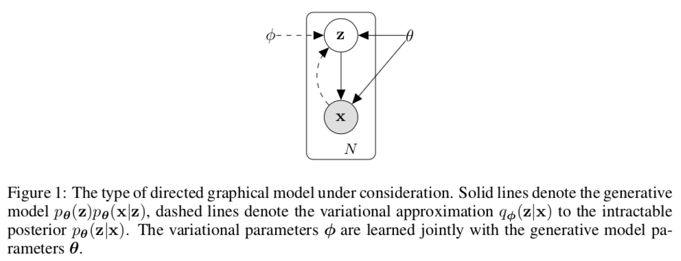
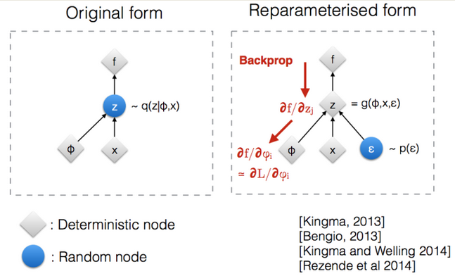

# Week 11: Variational Auto Encoders

### Assigned Reading

See [course website](http://www.cs.toronto.edu/~jessebett/CSC412/index.html).

## Motivation: Autoencoders (Deterministic)

An [autoencoders](https://en.wikipedia.org/wiki/Autoencoder) takes some data as input and learns some latent state representation of the data. More specifically, autoencoders reconstruct their own input using an **encoder** and a **decoder**.

**Encoder**: \(g(x) = Z \in F \quad x \in X\)

**Decoder**: \(f(z) = \tilde x\)

where \(X\) is the data space, and \(F\) is the feature space.

The _encoder_, \(g(x)\), takes in the input data (such as an image) and outputs a single value for each encoding dimension while the The _decoder_, \(f(z)\) takes this encoding and attempts to recreate the original input.

Our goal is to learn \(g, f\) from labeled data (which is nearly always done with a [neural network](https://en.wikipedia.org/wiki/Artificial_neural_network)).

!!! tip
    Much of this lecture comes from [this paper](http://papers.nips.cc/paper/7268-sticking-the-landing-simple-lower-variance-gradient-estimators-for-variational-inference), and forms the basis of all material on assignment 3.

\(z\) is the _code_ the model attempts to compress a representation of the input, \(x\), into. It is important that this code is a bottleneck, i.e. that

\[
\text{dim} \ F \lt \text{dim} \ X
\]

as this forces the autoencoder to engage in dimensionality reduction, for example by learning how to ignore noise (otherwise, we would just learn the identify function). The big idea is that the code contains only the most salient features of the input, such that we can reconstruct the input from the code reliably

\[
\tilde x = f(g(x)) \approx x
\]

### Problems with Deterministic Autoencoders

There are two main problems with deterministic autoencoders.

#### Problem 1: Proximity in data space does not mean proximity in feature space

The embeddings (or codes) learned by the model are deterministic, i.e.

\[
g(x_1) = z_1 \Rightarrow f(z_1) = \tilde x_1 \\
g(x_2) = z_2 \Rightarrow f(z_2) = \tilde x_2 \\
\]

but proximity in feature space is not enforced for inputs in close proximity in data space, i.e.

\[
z_1 \approx z_2 \not \Rightarrow x_1 \approx x_2
\]

The fundamental problem with autoencoders, for generation, is that the latent space they convert their inputs to and where their encoded vectors lie, _may not be continuous_, or allow easy interpolation. Indeed, given that these models are trained strictly to optimize reconstruction loss, the best strategy is often to encode each input into distinct clusters in the latent space to encode each type of data (class, etc) with discontinuities between clusters (as doing this will allow the decoder to easily reconstruct the input).

But when you’re building a generative model, you don’t want to prepare to replicate the same image you put in. You want to randomly sample from the latent space, or generate variations on an input image, from a continuous latent space.

If the space has discontinuities (eg. gaps between clusters) and you sample/generate a variation from there, the decoder will simply generate an unrealistic output, because the decoder has no idea how to deal with that region of the latent space. During training, it never saw encoded vectors coming from that region of latent space.

#### Problem 2: How to measure the goodness of a reconstruction?

An important question is how to measure how well the model is able to reconstruct its inputs. Take the simple example of reconstructing handwritten digits

In this case, the reconstruction looks quite good. However, if we chose a simple distance metric between inputs and reconstructions to measure the performance of our model, we would heavily penalize the left-shift in the reconstruction \(\tilde x\).

The point of this example is that choosing an appropriate metric for evaluating model performance can be difficult, and that a miss-aligned objective can be disastrous.

!!! note
    The loss function in this setting is referred to as the _reconstruction loss_. For autoencoders, the loss function is usually either the mean-squared error or cross-entropy between the output and the input.

## Variational Autoencoders (VAEs)

The big idea behind [**variational autoencoders (VAEs)**](https://en.wikipedia.org/wiki/Autoencoder#Variational_autoencoder_(VAE)) is to encode inputs with uncertainty. Unlike normal autoencoders, the encoder of a VAE (also called the _recognition model_) outputs a _probability distribution_ for each latent attribute, i.e., it encodes inputs \(x\) to a distribution over latent codes, \(p(z | x)\). With this modification, random sampling and interpolation become straightforward.

VAEs learn a [latent variable model](https://en.wikipedia.org/wiki/Latent_variable_model) for their input data. Instead of the encoder learning an encoding vector of size \(n\), it learns two vectors of size \(n\): vector of means, \(\mu\), and another vector of standard deviations, \(\sigma\).

Intuitively, the mean will control where the encoding of the input should be centered around while the standard deviation will control how much can the encoding vary from the mean. They form the parameters of a vector of random variables of length \(n\), with the \(i^{th}\) element of \(\mu\) and \(\sigma\) being the mean and standard deviation of the \(i^{th}\) random variable, \(x_i\), from which we sample, to obtain the sampled encoding which we pass onward to the decoder.

This stochastic generation means, that even for the same input, while the mean and standard deviations remain the same, the actual encoding will somewhat vary on every single pass simply due to sampling.

As encodings are generated at random from anywhere inside the “circle” (the distribution), the decoder learns that not only is a single point in latent space referring to a sample of that class, but all nearby points refer to the same as well. This allows the decoder to not just decode single, specific encodings in the latent space (leaving the decodable latent space discontinuous), but ones that slightly vary too, as the decoder is exposed to a range of variations of the encoding of the same input during training.

!!! note
    Much of this content came from [this](https://towardsdatascience.com/intuitively-understanding-variational-autoencoders-1bfe67eb5daf) Medium post. Please give it some claps if you found it useful.

### The specifics

Our model is represented by the joint distribution over the latent codes and the input data \(p_\theta(x, z)\). Decomposing this distribution, we get

\[
p_\theta(x, z) = \text{prior} \times \text{likelihood} = p_\theta(z)p_\theta(x | z)
\]

assuming our model looks like

!!! cite
    [Kingma, Diederik P., and Max Welling. "Auto-encoding variational bayes." arXiv preprint arXiv:1312.6114 (2013)](https://arxiv.org/abs/1312.6114).

then learning the model is just inference:

\[
p_\theta(z | x) = \frac{p_\theta(z)p_\theta(x | z)}{p_\theta(x)}
\]

however, as we said last lecture, learning

\[
p_\theta(x) = \int p_\theta(x | z) p_\theta(z) dz
\]

is intractable. Our solution was to introduce an approximate distribution with its own set of parameters, \(q_\phi\), and learn these parameters such that

\[
q_\phi (z | x) \approx p_\theta(z | x)
\]

which turned our inference problems into the optimization problem of minimizing the [KL divergence](https://en.wikipedia.org/wiki/Kullback%E2%80%93Leibler_divergence) between the true and approximate distributions

\[
D_{KL}(q_\phi(z | x) || p_\theta(z | x))
\]

finally, we demonstrated that minimizing \(D_{KL}\) was equivalent to maximizing the ELBO, \(L\)

\[
\mathcal L(\theta, \phi ; x) = \text{ELBO} = - E_{z_\phi \sim q_\phi} \log \frac{q_\phi(z | x)}{p_\theta(x, z)}
\]

We also talked about two other [alternative forms or "intuitions" of the ELBO](../week_10/#alternative-forms-of-elbo-and-intuitions):

\begin{align}
\mathcal L(\theta, \phi ; x) &= E_{z_\phi \sim q_\phi} \Big [ \log p_\theta({x | z}) + \log p_\theta({z}) - \log {q_\phi(z | x)} \Big ] \tag*{intuition (1)} \\
&= E_{z_\phi \sim q_\phi} \Big [ \log p_\theta({x | z}) \Big ] - D_{KL}(q_\phi(z | x) || p_\theta(z)) \tag*{intuition (3)}\\
\end{align}

The second of which (intuition 3) is the loss function we use for training VAEs. Notice now that the first term corresponds to the _likelihood of our input under the distribution decoded from \(z\)_ and the second term the _divergence of the approximate distribution posterior from the prior of the true distribution_.

!!! note
    We talked last week about how the second terms acts a regularization, by enforcing the idea that our parameterization shouldn't move us too far from the true distribution. Also note that this term as a simple, closed form if the posterior and prior are Gaussians.

The encoder and decoder in a VAE become:

**Encoder**: \(g(x_i) = \phi_i\)

**Decoder**: \(f(z_i) = \theta_i\)

Where \(\phi_i\) are the parameters of \(q_\phi(z_i | x_i)\) (we are encoding a distribution, which is exactly just its parameters) and \(\theta_i\) are the parameters of \(p_\theta(\tilde x_i | z_i)\), the reconstruction likelihood.

### Why does a VAE solve the problems of a deterministic autoencoder?

_Problem 1_

Unlike the encoder of a normal autoencoder, which encodes each input as a distinct point and forms distinct clusters in the latent space to encode each type of data (class, etc) with discontinuities between clusters (as doing this will allow the decoder to easily reconstruct the input), the VAE generation model learns to reconstruct its inputs not only from the encoded points but also _from the area around them_. This allows the generation model to generate new data by sampling from an “area” instead of only being able to generate already seen data corresponding to the particular fixed encoded points.

_Problem 2_

The first term in the ELBO is the _reconstruction likelihood_, i.e. the likelihood that we would have re-constructed our data under our model. This serves as our measure of "goodness" of the reconstructed inputs.

### VAE Pipeline

1. Run a given input, \(x_i\) through the encoder: \(g(x_i) = \phi_i\) to get the parameters of the approximate distribution \(q_{\phi_i}(z | x)\).
2. Sample \(z_i \sim q_{\phi_i}(z | x)\). This is the code in our feature space \(F\).
3. Run the sampled code through the decoder: \(f(z_i) = \theta_i\) to get the parameters of the true distribution \(p_{\theta_i}(x | z)\).
4. Compute the loss function: \(\mathcal L(x ; \theta, \phi) = - E_{z_\phi \sim q_\phi} \Big [ \log p_\theta({x | z}) \Big ] + D_{KL}(q_\phi(z | x) || p_\theta(z))\)
5. Use gradient-based optimization to backpropogate the loses \(\nabla_\theta L\), \(\nabla_\phi L\)

Once a VAE is trained, we can sample new inputs

\[
\tilde x_i \sim p_\theta(x | z_i)
\]

We can also interpolate between inputs, using simple vector arithmetic.

!!! note
    This sampling is never performed during training.

### Gradient Example: MNIST

Lets walk through an example of computing the gradients for a VAE on MNIST.

We will choose our prior on \(z\) to be the standard Gaussian with zero mean and unit variance

\[
\mathcal{N}(0, I)
\]

our likelihood function to be

\[
p_\theta(x | z) = \Big \{^{\text{Bernoulli if binarized}}_{\sigma (\text{Gaussian}) \text{ else}}
\]

and our approximate distribution to be

\[
q_\phi(z | x) = \mathcal{N}(\mu(x), \sigma(x)I)
\]

!!! note
    Notice that our mean and variance are functions of the input.

Finally, we use neural networks as our encoder and decoder

**Encoder**: \(g_\phi(x_i) = \phi_i = [u_i, \log \sigma_i]\)

**Decoder**: \(f_\theta(z_i) = \theta_i\)

Where \(\theta_i\) are the Bernoulli variables for each pixel in the input. To get our reconstructed input, we simply evaluate

\[
\tilde x_i \sim p_{\theta_i}(x | z)
\]

!!! note
    We log the variance in the encoder (\(\log \sigma_i\)) in order to force outputs to be positive. This allows the neural network to learn parameters in an unconstrained space.

The entire model looks like:

!!! cite
    [Variational Autoencoder Explained](https://mohitjain.me/2018/10/26/variational-autoencoder/).

Where inputs \(x_i\) are encoded to vectors \(\mu\) and \(\log \sigma_i\), which parameterize \(q_\phi(z | x)\). Before decoding, we draw a sample \(z \sim q_\phi(z | x) = \mathcal{N}(\mu(x), \sigma(x)I)\) and evaluate its likelihood under the model with \(p_\theta(x | z)\). We compute the loss function \(\mathcal L(\theta, \phi ; x)\) and propagate its derivative with respect to \(\theta\) and \(\phi\), \(\nabla_\theta L\), \(\nabla_\phi L\), through the network during training.

### The Reparameterization Trick

The decoder generates a reconstruction by first sampling from the distribution \(q_\phi(z | x)\). This sampling process introduces a major problem: gradients are blocked from flowing into the encoder, and hence it will not train. To solve this problem, the [reparameterization trick](https://medium.com/@llionj/the-reparameterization-trick-4ff30fe92954) is used.

The trick goes as follows: Instead of sampling \(z\) directly from its distribution (e.g. \(z \sim \mathcal{N}(\mu(x), \sigma(x)I)\)) we express \(z\) as a [deterministic variable](https://en.wikipedia.org/wiki/Deterministic_system):

\[
z = g_\phi(\varepsilon, x)
\]

where \(\varepsilon\) is an auxiliary independent random variable and \(g_\phi\) converts \(\varepsilon\) to \(z\).

In the case of where our approximate distribution is chosen to be the multivariate normal with diagonal covariance, the reparameterization trick gives:

\[
z = \mu + \sigma * \varepsilon \quad \text{where } \varepsilon \sim \mathcal N(0, I)
\]

with this reparameterization, gradients can now flow through the entire network

## Appendix

### Useful Resources

- [Keras Blog](https://blog.keras.io/building-autoencoders-in-keras.html) on autoencoders.
- [Blog](https://mohitjain.me/2018/10/26/variational-autoencoder/) on VAEs.
- [Blog](https://towardsdatascience.com/intuitively-understanding-variational-autoencoders-1bfe67eb5daf) on the intuitive understanding of VAEs.
- The [original VAE paper](https://arxiv.org/abs/1312.6114) (which assignment 3 is based on) and a [video](https://www.youtube.com/watch?time_continue=2&v=9zKuYvjFFS8) explanation.
- [Blog](https://medium.com/@llionj/the-reparameterization-trick-4ff30fe92954) on the reparameterization trick.

### Glossary of Terms
