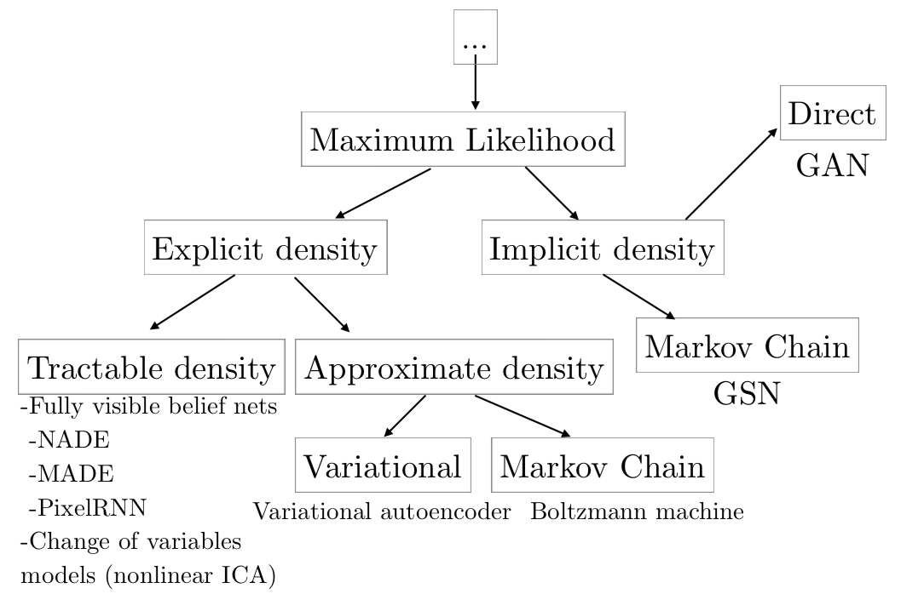

# Week 12: General Adversarial Networks (GANs)

### Assigned Reading

- [NIPS 2016 Tutorial: Generative Adversarial Networks; Goodfellow (2016)](https://arxiv.org/pdf/1701.00160.pdf)
- [Generative adversarial networks; Goodfellow et al. (2014)](https://arxiv.org/abs/1406.2661)

In the first half of this lecture, we will review the [generative models](https://en.wikipedia.org/wiki/Generative_model) that we have discussed so far.

## Generative Models, a Review

Generative models make the assumption that your data was generated from some distribution

\[
\{x_i\}_{i=1}^N \sim P_{data}
\]

This is the distribution we will attempt to learn. More specifically, we want to learn a model, \(P_{model}\), that represents an estimate of \(P_{data}\). If we have done our job correctly, then samples from our model

\[
\tilde x_i \sim P_{model}
\]

should look like samples from our data. The density \(P_{model}\) can be

1. explicitly defined
2. approximated by random sampling from our model.

So far, we have only looked at models of the first type, sometimes referred to as __explicit density models__.

As an example of the simplest possible model of the second type, sometimes referred to as __implicit density models__, imagine we had a sampler:

\[
j = \text{randint}(1:N) \\
\text{return} \ x_j
\]

This perhaps is the most trivial generative model we could define. Clearly, this model has no _"understanding"_ of the distribution that generated our data. But what does it mean to _"understand"_ a data distribution?

- the ability to generate new data
- the ability to smoothly interpolate between data points \(x_i \rightarrow x_j\)
- the ability to generate samples representing _"underlying features of variation"_

!!! tip
    For the last point, think of the example of generating images. We might expect a sampled images from a _good_ model to contain variation in the lighting, or camera angle.

We have [previously discussed auto-encoders](../week_11), which achieve this _"understanding"_ of our data via compression.

Of course, this begs the question: Why do we want our models to be able to _"understand"_ a data distribution in the first place?

- Samples from high dimensional distributions are useful and serve as an excellent test of our ability to represent and manipulate high-dimensional probability distributions (import objects in a wide variety of applied math and engineering domains).
- Model-based RL makes use of generative models.
- Generative models can be trained with missing data and can provide predictions on inputs that are missing data (e.g. semi-supervised learning)
- Generative modals enable machine learning to work with multi-modal outputs (for many tasks, a single input may correspond to many different correct answers, each of which is acceptable).
- Finally, many tasks intrinsically require realistic generation of samples from some distribution, e.g.
    - single image super-resolution
    - art creation
    - image-to-image translation

### Prototypical Generative Model

The prototypical generative model follows the following procedure:

1. Sample some noise, \(z \sim p(z)\)
2. Pass this noise through a model, \(G\)
3. Get a sample, \(x\) from \(G(z)\)

In VAEs, we saw that

\[
x \sim p_\theta(x | z)
\]

### Maximum Likelihood Estimate

Maximum likelihood estimate is [how we have trained all the generative models we have seen thus far](../week_2/#maximum-likelihood-estimation).

The basic idea is to:

1. Define a model which provides an estimate of a probability distribution parameterized by parameters \(\theta\)
2. Define a likelihood function that represents the probability of our data and train our parameters to maximize this likelihood

e.g. for the i.i.d case:

\[
\prod_{i=1}^N P_{model} (x^{(i)}, \theta) \\
\Rightarrow \hat \theta_{MLE} = \underset{\theta}{\operatorname{argmax}} \sum \log P_{model} (x^{(i)} ; \theta)
\]

which is equivalent to the minimizing the \(D_{KL}\) between \(P_{data}(x)\) and \(P_{model}(x ; \theta)\)

\[
\underset{\theta}{\operatorname{argmin}} D_{KL}(P_{data}(x) || P_{model}(x ; \theta))
\]

If we were able to do this precisely, and if \(P_{data}\) lies within the family of distributions \(P_{model}(x ; \theta)\), then the model would recover \(P_{data}\) exactly. In practice, we do not have access to \(P_{data}\) itself, but only to a training set consisting of \(m\) samples from \(P_{data}\). We uses these to define \(\hat P_{data}\), an empirical distribution that places mass only on exactly those \(m\) points, approximating \(P_{data}\). Minimizing the \(D_{KL}\) between \(\hat P_{data}\) and \(P_{model}\) is exactly equivalent to maximizing the log-likelihood of the training set.

### Explicit Density Models

In explicit density models (i.e., the models we are discussing and have been discussing the entire course) define an explicit density function \(P_{model}(x ; \theta)\). For these models, maximization of the likelihood function is straightforward: we simply plug the models definition of the density function into the expression for likelihood and follow the gradient uphill.

The main difficulty present in explicit density models is designing a model that can capture all of the complexity of the data to be generated while still maintaining computational tractability.

1. careful construction of models whose structure guarantees their tractability
2. models that admit tractable approximations to the likelihood and its gradients

_Tractable_ examples include:

- Fully Visible Belief Nets (96, 98)
- WaveNet (2016)

In the _intractable_ case, we use variational (e.g. [VAEs](../week_11/#variational-autoencoders-vaes)) or [MCMC approximations](../week_8/#metropolis-hastings-method) to get at \(\log p_\theta(x)\).

### Generative Model Goal

The goal of generative models, in short, is to produce samples similar to \(P_{data}\). But do we really need maximum likelihood estimations to achieve our goals?

!!! tip
    Everything up until this point was considered review. Everything that follows is new content.

## Implicit Density Models

In implicit density models, we do not define \(P_{model}(x, \theta)\) explicitly. Instead, we interact with \(P_{model}\) through samples.

A taxonomic tree of generative models is shown below:

!!! cite
    [NIPS 2016 Tutorial: Generative Adversarial Networks; Goodfellow (2016)](https://arxiv.org/pdf/1701.00160.pdf).

_But how do we train it?_ No density means _no likelihood evaluation_.

### General Adversarial Network (GAN) Approach

In the general adversarial approach, we _do not_ have likelihoods, only samples. The idea is based on an adversarial game and pulls heavily from [game theory](https://en.wikipedia.org/wiki/Game_theory).

The basic idea of GANs is to set up a game between two players:

- One of them is called the **generator** (\(G_{\theta_G}\)). The generator creates samples that are intended to come from the same distribution as the training data.
- The other player is the **discriminator** (\(D_{\theta_D}\)). The discriminator examines samples to determine whether they are real or fake.

The discriminator learns using traditional supervised learning techniques, dividing inputs into two classes (real or fake). The generator is trained to fool the discriminator. Both are almost always modeled as neural networks (and are therefore differentiable w.r.t their outputs)

!!! tip
    We can think of the generator as being like a counterfeiter, trying to make fake money, and the discriminator as being like police, trying to allow legitimate money and catch counterfeit money. To succeed in this game, the counterfeiter must learn to make money that is indistinguishable from genuine money, and the generator network must learn to create samples that are drawn from the same distribution as the training data.
