# Week 3: Directed Graphical Models

### Assigned Reading

- Murphy: Chapters 10-12 (excluding * sections)
- [Kevin Murphy's page on graphical models](http://www.cs.ubc.ca/~murphyk/Bayes/bnintro.html)
- [Roger Grosse's slides on backprop](http://www.cs.toronto.edu/~rgrosse/courses/csc321_2017/slides/lec6.pdf)

### Overview

- Graphical notations
- Conditional independence
- Bayes Balls
- Latent variables
- Common motifs

## Graphical model notation

The joint distribution of \(N\) random variables can be computed by the [chain rule](https://en.wikipedia.org/wiki/Chain_rule_%28probability%29)

\[p(x_{1, ..., N}) = p(x_1)p(x_2|x_1)p(x_3 | x_2, x_1) \ldots \]

this is true for _any joint distribution over any random variables_.

More formally, in probability the chain rule for two random variables is

\[p(x, y) = p(x | y)p(y)\]

and for \(N\) random variables

\[p(\cap^N_{i=1}) = \prod_{k=1}^N p(x_k | \cap^{k-1}_{j=1} x_j)\]

!!! note
    Note that this is a bit of an abuse of notation, but \(p(x_k | \cap^{k-1}_{j=1} x_j)\) will collpase to \(p(x_1)\) when \(k\) = 1.

Graphical, we might represent a model

\[p(x_i, x_{\pi_i}) = p(x_{\pi_i})p(x_i | x_{\pi_i})\]

as

where

- nodes represent random variables
- arrows mean "conditioned on", e.g. "\(x_i\) is conditioned on \(x_{\pi_1}\)".

For example, the graphical model \(p(x_{1, ..., 6})\) is represented as

This is what the model looks like with _no assumptions_ on the conditional dependence between variables (said otherwise, we assume full conditional dependence of the joint distribution as per the chain rule). This model will _scale poorly_ (exponential with the number of parameters, or \(k^n\) where \(k\) are states and \(n\) are random variables, or nodes.).

We can simplify the model by building in our assumptions about the conditional probabilities. More explicitly, a [directed graphical model](#directed-acyclic-graphical-models-dagm) implies a restricted factorization of the joint distribution.

### Conditional Independence

Let \(X\) be the set of nodes in our graph (the random variables of our model), then two (sets of) variables \(X_A\), \(X_B\) are conditionally independent given a third variable \(X_C\)

\\[(X_A \perp X_B | X_C)\\]

if

\[
\Leftrightarrow p(X_A, X_B | X_C) = p(X_A | X_C)p(X_B | X_C) \; (\star)
\]

\[
\Leftrightarrow p(X_A | X_B, X_C) = p(X_A | X_C) \; (\star\star)
\]

for all \(X_c\).

!!! note
    \(\star\star\) is especially important, and we use this several times throughout the lecture.

Only a subset of all distributions respect any given (nontrivial) conditional independence statement. The subset of distributions that respect all the CI assumptions we make is the family of distributions consistent with our assumptions. Probabilistic graphical models are a powerful, elegant and simple way to specify such a family.

## Directed acyclic graphical models (DAGM)

A [directed acyclic graphical model](https://en.wikipedia.org/wiki/Graphical_model#Bayesian_network) over \(N\) random variables looks like

\[p(x_{1, ..., N}) = \prod_i^Np(x_i | x_{\pi_i})\]

where \(x_i\) is a random variable (node in the graphical model) and \(x_{\pi_i}\) are the parents of this node. In other words, the joint distribution of a DAGM factors into a product of _local conditional distributions_, where each random variable (or node) is conditionally dependent on its parent node(s), which could be empty.

!!! tip
    The Wikipedia entry on [Graphical models](https://en.wikipedia.org/wiki/Graphical_model) is helpful, particularly the section on [Bayesian networks](https://en.wikipedia.org/wiki/Graphical_model#Bayesian_network).

Notice the difference between a DAGM and the chain rule for probability we introduced early: we are conditioning on _parent nodes_ as opposed to _every node_. Therefore, the model that represents this distribution is exponential in the [fan-in](https://en.wikipedia.org/wiki/Fan-in) of each node (the number of nodes in the parent set), instead of in \(N\).

### Independence assumptions on DAGMs

Lets look again at the graphical model \(p(x_{1, ..., 6})\) we introduced above.

First, lets sort the DAGM topologically. The conditional independence of our random variables becomes

\[x_i \bot x_{\widetilde{\pi_i}} | x_{\pi_i}\]

so random variables \(x_i\) and \(x_{\widetilde{\pi_i}}\) are conditionally independent of each other but conditionally dependent on their parent nodes \(x_{\pi_i}\).

!!! note
    To [topological sort](https://en.wikipedia.org/wiki/Topological_sorting) or order a DAGM means to sort all parents before their children.

Lastly, lets place some assumptions on the conditional dependence of our random variables. Say our model looks like

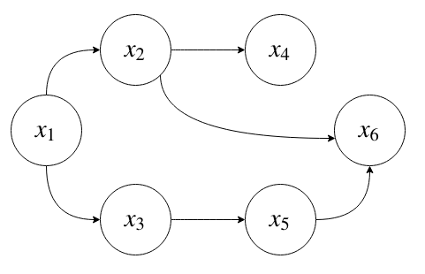

What have the assumptions done to our joint distribution represented by our model?

\[p(x_{1, ..., 6}) = p(x_1)p(x_2 | x_1)p(x_3 | x_1)p(x_4 | x_2)p(x_5 | x_3)p(x_6 | x_2, x_5)\]

Cleary our assumptions on conditional independence have vastly simplified the model.

Now Suppose each is \(x_i\) is a binary random variable. Our assumptions on conditional independence also reduce the dimensionality of our model

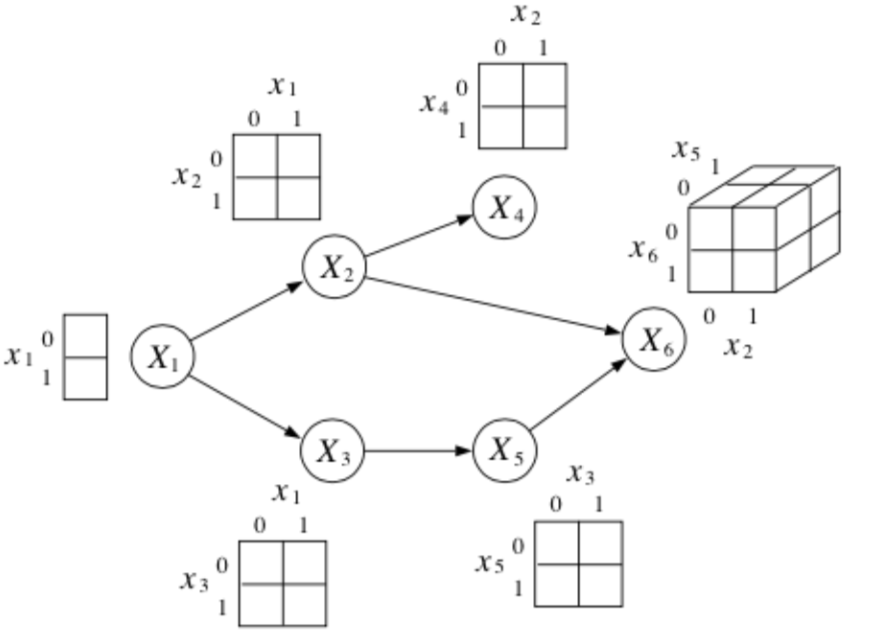

#### Missing Edges

Missing edges _imply conditional independence_. Recall that from the chain rule, we can get (for any joint distribution)

\[p(\cap^N_{i=1}) = \prod_{k=1}^N p(x_k | \cap^{k-1}_{j=1} x_j)\]

If our joint distribution is represented by a DAGM, however, then some of the conditioned variables can be dropped. This is equivalent to enforcing conditional independence.

### D-Separation

**D-separation**, or **directed-separation** is a notion of connectedness in DAGMs in which two (sets of) variables _may or may not be connected_ conditioned on a third (set of) variable(s); where D-connection implies conditional _dependence_ and d-separation implies conditional _independence_.

In particular, we say that

\[x_A \bot x_B | x_C\]

if every variable in \(A\) is d-separated from every variable in \(B\) conditioned on all the variables in \(C\). We will look at two methods for checking if an independence is true: A depth-first search algorithm and [Bayes Balls](https://metacademy.org/graphs/concepts/bayes_ball#focus=bayes_ball&mode=learn).

#### DFS Algorithm for checking independence

To check if an independence is true, we can cycle through each node in \(A\), do a depth-first search to reach every node in \(B\), and examine the path between them. If all of the paths are d-separated, then we can assert

\[x_A \bot x_B | x_C\]

Thus, it will be sufficient to consider triples of nodes.

!!! note
    It is not totally clear to me _why_ it is sufficient to consider triples of nodes. This is simply stated "as is" on the lecture slides.

Lets go through some of the most common triples.

!!! tip
    It was suggested in class that these types of examples make for really good midterm questions!

__1. Chain__

_Question_: When we condition on \(y\), are \(x\) and \(z\) independent?

_Answer_:

From the graph, we get

\[P(x, y, z) = P(x)P(y|x)P(z|y)\]

which implies

\begin{align}
P(z | x, y) &= \frac{P(x, y, z)}{P(x, y)} \\
&= \frac{P(x)P(y|x)P(z|y)}{P(x)P(y|x)} \\
&= P(z | y) \\
\end{align}

\(\therefore\) \(P(z | x, y) = P(z | y)\) and so by \(\star\star\), \(x \bot z | y\).

!!! tip
    It is helpful to think about \(x\) as the past, \(y\) as the present and \(z\) as the future when working with chains such as this one.

__2. Common Cause__

Where we think of \(y\) as the "common cause" of the two independent effects \(x\) and \(z\).

_Question_: When we condition on \(y\), are \(x\) and \(z\) independent?

_Answer_:

From the graph, we get

\[P(x, y, z) = P(y)P(x|y)P(z|y)\]

which implies

\begin{align}
P(x, z | y) &= \frac{P(x, y, z)}{P(y)} \\
&= \frac{P(y)P(x|y)P(z|y)}{P(y)} \\
&= P(x|y)P(z|y) \\
\end{align}

\(\therefore\) \(P(x, z| y) = P(x|y)P(z|y)\) and so by \(\star\), \(x \bot z | y\).

__3. Explaining Away__

_Question_: When we condition on \(y\), are \(x\) and \(z\) independent?

_Answer_:

From the graph, we get

\[P(x, y, z) = P(x)P(z)P(y|x, z)\]

which implies

\begin{align}
P(z | x, y) &= \frac{P(x)P(z)P(y | x,  z)}{P(x)P(y|x)} \\
&= \frac{P(z)P(y | x,  z)}{P(y|x)}  \\
&\not = P(z|y) \\
\end{align}

\(\therefore\) \(P(z | x, y) \not = P(z|y)\) and so by \(\star\star\), \(x \not \bot z | y\).

In fact, \(x\) and \(z\) are _marginally independent_, but given \(y\) they are _conditionally independent_. This important effect is called explaining away ([Berkson’s paradox](https://en.wikipedia.org/wiki/Berkson%27s_paradox)).

!!! example
    Imaging flipping two coins independently, represented by events \(x\) and \(z\). Furthermore, let \(y=1\) if the coins come up the same and \(y=0\) if they come up differently. Clearly, \(x\) and \(z\) are independent, but if I tell you \(y\), they become coupled!

#### Bayes-Balls Algorithm

An alternative algorithm for determining conditional independence is the [Bayes Balls](https://metacademy.org/graphs/concepts/bayes_ball#focus=bayes_ball&mode=learn) algorithm. To check if \(x_A \bot x_B | x_C\) we need to check if every variable in \(A\) is d-seperated from every variable in \(B\) conditioned on all variables in \(C\). In other words, given that all the nodes in \(x_C\) are "clamped", when we "wiggle" nodes \(x_A\) can we change any of the nodes in \(x_B\)?

In general, the algorithm works as follows: We shade all nodes \(x_C\), place "balls" at each node in \(x_A\) (or \(x_B\)), let them "bounce" around according to some rules, and then ask if any of the balls reach any of the nodes in \(x_B\) (or \(x_A\)).

_The rules are as follows_:

including the _boundary rules_:

where **arrows** indicate paths the balls _can_ travel, and **arrows with bars** indicate paths the balls _cannot_ travel.

!!! note
    Notice balls can travel opposite to edge directions!

Here’s a trick for the explaining away case: If \(y\) _or any of its descendants_ is **shaded**, the ball passes through.

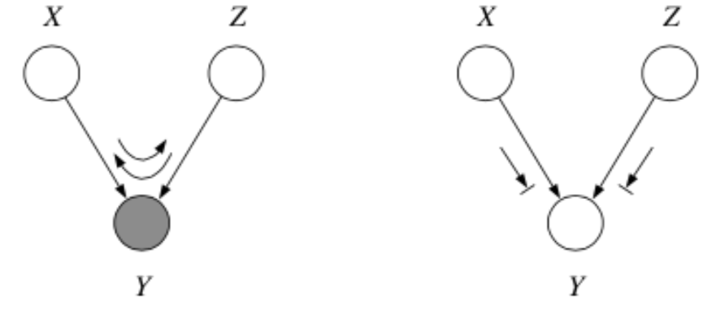

##### Canonical Micrographs

For reference, here are some canonical micrographs and the Bayes Balls algorithmic rules that apply to them

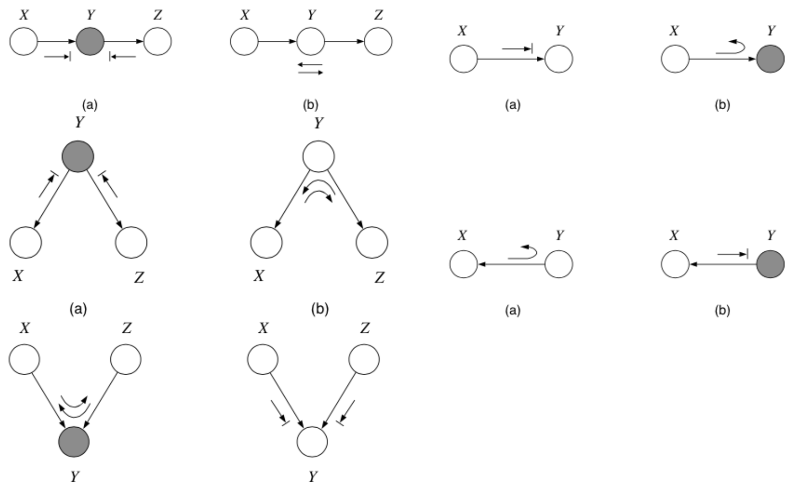

!!! tip
    See [this video](https://www.youtube.com/watch?v=jgt0G2PkWl0) for an easy way to remember all the rules.

##### Examples

_Question_: In the following graph, is \(x_1 \bot x_6 | \{x_2, x_3\}\)?

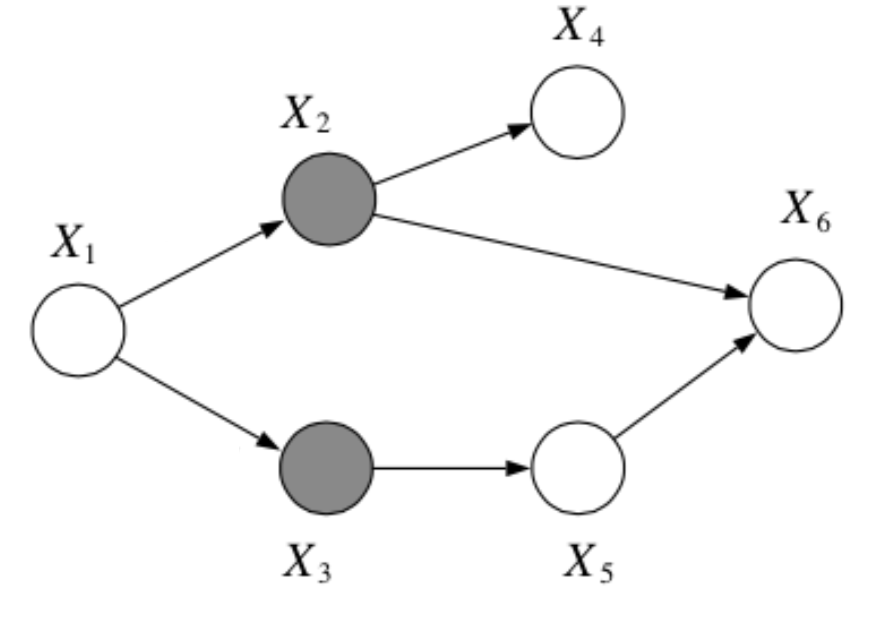

_Answer_:

 Yes, by the Bayes Balls algorithm.

 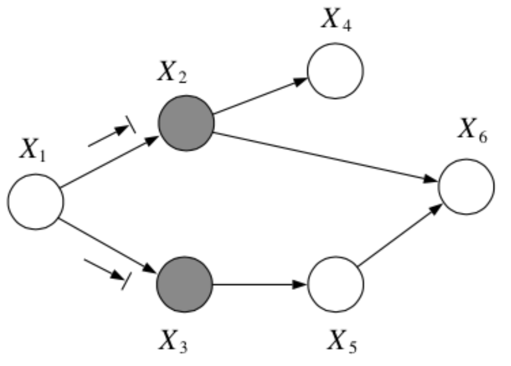

 _Question_: In the following graph, is \(x_2 \bot x_3 | \{x_1, x_6\}\)?

 

 _Answer_:

  No, by the Bayes Balls algorithm.

  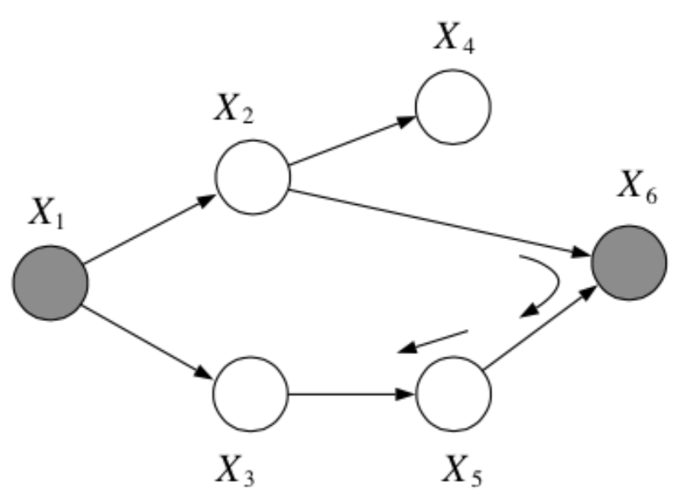

### Plates

Because Bayesian methods treat parameters as random variables, we would like to include them in the graphical model. One way to do this is to repeat all the iid observations explicitly and show the parameter only once. A better way is to use __plates__, in which repeated quantities that are iid are put in a box

Plates are like “macros” that allow you to draw a very complicated graphical model with a simpler notation.
_The rules of plates are simple_: repeat every structure in a box a number of times given by the integer in the corner of the box (e.g. \(N\)), updating the plate index variable (e.g. \(n\)) as you go. Duplicate every arrow going into the plate and every arrow leaving the plate by connecting the arrows to each copy of the structure.

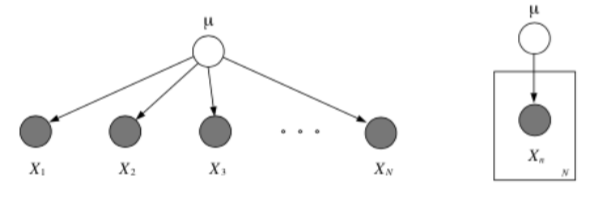

#### Nested Plates

Plates can be nested, in which case their arrows get duplicated also, according to the rule: draw an arrow from every copy of the source node to every copy of the destination node.

Plates can also cross (intersect), in which case the nodes at the intersection have multiple indices and get duplicated a number of times equal to the product of the duplication numbers on all the plates containing them.

### Example of a DAGM: Markov Chain

[Markov chains](https://en.wikipedia.org/wiki/Markov_chain) are a stochastic model describing a sequence of possible events in which the probability of each event depends only on the state attained in the previous event.

In other words, it is a model that satisfies the [Markov property](https://en.wikipedia.org/wiki/Markov_property), i.e., conditional on the present state of the system, its future and past states are independent.

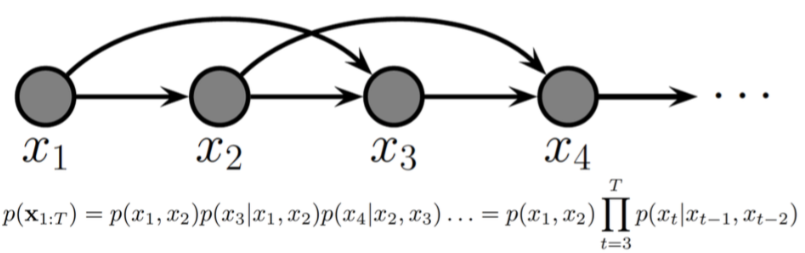

!!! warning
    I don't really understand the difference between the two models given on the slides (and shown above). Are they both Markov chains? In the second model, the probability of an event depends not just on the previous node but on the previous node of the previous node. Jesse went over this only very briefly in lecture.

### Unobserved Variables

Certain variables in our models may be unobserved (\(Q\) in the example given below), either some of the time or always, at training time or at test time.

!!! note
    Graphically, we will use shading to indicate observation

#### Partially Unobserved (Missing) Variables

If variables are _occasionally unobserved_ then they are _missing data_, e.g., undefined inputs, missing class labels, erroneous target values. In this case, we can still model the joint distribution, but we define a new cost function in which we sum out or marginalize the missing values at training or test time

\\[\ell(\theta ; \mathcal D) = \sum_{\text{complete}} \log p(x^c, y^c | \theta) + \sum_{\text{missing}} \log p(x^m | \theta)\\]
\\[= \sum_{\text{complete}} \log p(x^c, y^c | \theta) + \sum_{\text{missing}} \log \sum_y p(x^m, y | \theta)\\]

!!! note
    Recall that \(p(x) = \sum_q p(x, q)\).

#### Latent

What to do when a variable \(z\) is _always_ unobserved? Depends on where it appears in our model. If we never condition on it when computing the probability of the variables we do observe, then we can just forget about it and integrate it out.

E.g., given \(y\), \(x\) fit the model \(p(z, y|x) = p(z|y)p(y|x, w)p(w)\). In other words if it is a leaf node.

However, if \(z\) is conditioned on, we need to model it.

E.g. given \(y\), \(x\) fit the model \(p(y|x) = \sum_z p(y|x, z)p(z)\).

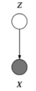

##### Where do latent variables come from?

Latent variables may appear naturally, from the structure of the problem (because something wasn’t measured, because of faulty sensors, occlusion, privacy, etc.). But we also may want to _intentionally_ introduce latent variables to model complex dependencies between variables without looking at the dependencies between them directly. This can actually simplify the model (e.g., mixtures).

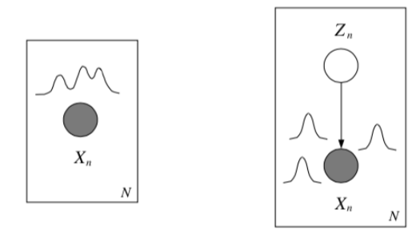

### Mixture models

Think about the following two sets of data, and notice how there is some underlying structure _not dependent on x_.

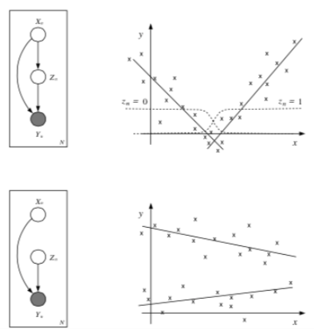

The most basic latent variable model might introduce a single discrete node, \(z\), in order to better model the data. This allows different submodels (experts) to contribute to the (conditional) density model in different parts of the space (known as a [mixture of experts](https://en.wikipedia.org/wiki/Mixture_of_experts)).

!!! note
    The basic idea is to divide & conquer: use simple parts to build complex models (e.g., multimodal densities, or piecewise-linear regressions).

#### Mixture densities

What if the class is _unobserved_? Then we sum it out

\[
p(x | \theta) = \sum_{k=1}^Kp(z=k | \theta_z)p(x|z=k, \theta_k) \\
= \sum_{k=1}^K\alpha_k p_k(x|\theta_k)
\]

where the __mixing proportions__, \(\alpha_k\) sum to 1, i.e. \(\sum_k\alpha_k = 1\). We can use Bayes' rule to compute the posterior probability of the mixture component given some data:

\[
p(z=k | x, \theta_z) = \frac{\alpha_k p_k(x|\theta_k)}{\sum_j\alpha_j p_j(x|\theta_j)}
\]

these quantities are called __responsibilities__.

###### Example: Gaussian Mixture Models

Consider a mixture of \(K\) Gaussian componentns

\[
p(x | \theta) = \sum_k \alpha_k \mathcal N(x | \mu_k, \Sigma_k) \\
p(z = k | x, \theta) = \frac{\alpha_k \mathcal N(x | \mu_k, \Sigma_k)}{\sum_j \alpha_j \mathcal N(x | \mu_j, \Sigma_j)} \\
\ell(\theta ; \mathcal D) = \sum_n \log \sum_k \alpha_k \mathcal N(x^{(n)} | \mu_k, \Sigma_k) \\
\]

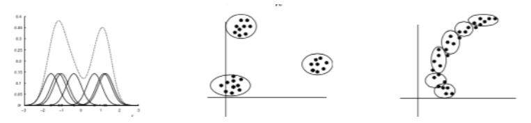

- Density model: \(p(x | \theta)\) is a familiarity signal.
- Clustering: \(p(z | x, \theta)\) is the assignment rule, \(- \ell(\theta)\) is the cost.

!!! warning
    I didn't really understand this example.

###### Example: Mixtures of Experts

[Mixtures of experts](https://en.wikipedia.org/wiki/Mixture_of_experts), also known as conditional mixtures are exactly like a class-conditional model, but the class is unobserved and so we sum it out:

\[
p(y | x, \theta) = \sum_{k=1}^Kp(z=k|x, \theta_z)p(y|z=k, x, \theta_K) \\
= \sum_k \alpha_k (x | \theta_z)p_k(y | x, \theta_k) \\
\]

where \(\sum_k \alpha_k (x) = 1 \; \forall x\). This is a harder problem than the previous example, as we must learn \(\alpha(x)\), often called the __gating function__ (unless we chose \(z\) to be independent of \(x\)). However, we can still use Bayes' rule to compute the posterior probability of the mixture components given some data:

\[
p(z = k | x, y, \theta) = \frac{\alpha_k(x) p_k(y| x, \theta_k)}{\sum_j\alpha_j(x) p_j(y|x_j, \theta_j)}
\]

###### Example: Mixtures of Linear Regression Experts

In this model, each expert generates data according to a linear function of the input plus additive Gaussian noise

\[
p(y | x, \theta) = \sum_k \alpha_k \mathcal N(y | \beta_k^Tx, \sigma_k^2)
\]

where the gating function can be a softmax classifier

\[
\alpha_k(x) = p(z=k | x) = \frac{e^{\eta_k^Tx}}{\sum_je^{\eta_k^Tx}}
\]

Remember: we are _not_ modeling the density of the inputs \(x\).

#### Gradient learning with mixtures

!!! error
    Left off at Gradient learning with Mixtures

## Appendix

### Useful Resources

- [Metacademy lesson on Bayes Balls](https://metacademy.org/graphs/concepts/bayes_ball#focus=bayes_ball&mode=learn). In fact, that link will bring you to a short course on a couple important concepts for this corse, including conditional probability, conditional independence, Bayesian networks and d-separation.
- [A video](https://www.youtube.com/watch?v=jgt0G2PkWl0) on how to memorize the Bayes Balls rules (this is linked in the above course).

### Glossary of Terms
