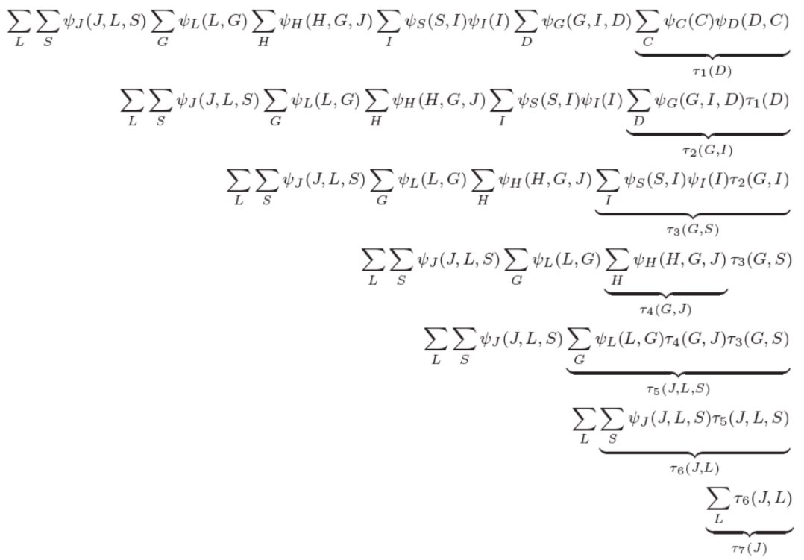

# Week 5: Exact Inference

### Assigned Reading

- Murphy: Chapter 20
- MacKay: Chapter 21.1 (worked example with numbers)
- MacKay: Chapter 16 (Message Passing, including soldier intuition)
- MacKay: Chapter 26 Exact Inference on Factor Graphs

### Overview

- Variable elimination (VE)
- Complexity of VE
- Belief propogation

## Inference in PGM

In this lecture, we will explore [inference](https://en.wikipedia.org/wiki/Statistical_inference) in probabilistic graphical models (PGM).

Let

\[
X_F = \text{The unobserved variable we want to infer} \\
X_E = \text{The observed evidence} \\
X_R = X - \{X_F, X_E\}
\]

where \(X_R\) is the set of random variables in our model that are neither part of the query nor the evidence. We will focus computing the conditional probability distribution

\[
p(X_F | X_E) = \frac{p(X_F, X_E)}{p(X_E)}
\]

i.e., we want to compute the posterior marginal density of some unobserved variables \(X_F\) given some evidence \(X_E\). Our MAP estimate of \(X_F\), \(\hat X_F\) is

\[
\text{MAP } \hat X_F = \underset{X_F}{\operatorname{argmax}} p(X_E, X_F) = \underset{X_F}{\operatorname{argmax}} P(X_F | X_E)
\]

each of the distributions we need to compute scan be computed by marginalizing over the other variables.

\[
p(X_F, X_E) = \sum_{X_R}p(X_F, X_E, X_R) \\
p(X_E) = \sum_{X_F, X_R}p(X_F, X_E, X_R)
\]

However, naively marginalizing over all unobserved variables requires a number of computations exponential in the number of random variables, \(N\), in our model.

### Variable elimination

[Variable elimination](https://en.wikipedia.org/wiki/Variable_elimination) is a simple and general exact inference algorithm in _any_ probabilistic graphical models.

The running time will depend on the _graph structure_ of the model, _but_, by using [dynamic programming](https://en.wikipedia.org/wiki/Dynamic_programming) we can avoid enumerating all assignments.

#### Simple Example: Chain

Lets start with the example of a simple chain

\[
A \rightarrow B \rightarrow C \rightarrow D
\]

where we want to compute \(P(D)\). We have

\[
X_F = \{D\}, \ X_E = \{\}, \ X_R = \{A, B, C\}
\]

and

\[
P(D) = \sum_{A, B, C}p(A, B, C, D) \\
= \sum_C \sum_B \sum_A p(A)p(B | A) p(C | B) p(D | C)
\]

clearly, this is exponential in the number of variables (\(\mathcal O(k^n)\)). But, reordering the joint distribution

\[
P(D) = \sum_C p(D | C) \sum_B p(C | B) \sum_A p(A)p(B | A)
\]

we can begin to simplify the summation

\[
P(D) = \sum_C p(D | C) \sum_b p(C | B) \sum_A p(A)p(B | A) \\
= \sum_C p(D | C) \sum_B p(C | B) P(B) \\
= \sum_C p(D | C) P(C) \\
\]

So, by using dynamic programming to do the computation _inside out_ instead of _outside in_, we have done inference over the joint distribution represented by the chain _without generating it explicitly_. The cost of performing inference on the chain in this manner is \(\mathcal O(nk^2)\). In comparison, generating the full joint distribution and marginalizing over it has complexity \(\mathcal O(k^n)\)!

!!! tip
    See slide 7-13 for a full derivation of this example, including the runtime \(\mathcal O(nk^2)\).

#### Simple Example: DGM

Lets take the DGM we saw in [lecture 3](../week_3/#independence-assumptions-on-dagms)

What is \(p(x_1 | \bar x_6)\)? We have

!!! note
    The \(\bar x\) means that the variable is observed.

\[
\ X_F = \{x_1\}, X_E = \{\bar x_6\}, \ X_R = \{x_2, x_3, x_4, x_5\}
\]

and

\[
p(x_1 | \bar x_6) = \frac{p(x_1, \bar x_6)}{p(\bar x_6)} =  \frac{p(x_1, \bar x_6)}{\sum_{x_1}p(x_1, \bar x_6)}
\]

to compute \(p(x_1, \bar x_6)\), we use variable elimination

\[
p(x_1, \bar x_6) = p(x_1) \sum_{x_2} \sum_{x_3} \sum_{x_4} \sum_{x_5} p(x_2 | x_1)p(x_3 | x_1)p(x_4 | x_2)p(x_5 | x_3)p(\bar x_6 | x_2, x_5)\\
= p(x_1) \sum_{x_2} p(x_2 | x_1) \sum_{x_3} p(x_3 | x_1) \sum_{x_4} p(x_4 | x_2) \sum_{x_5} p(x_5 | x_3)p(\bar x_6 | x_2, x_5) \\
= p(x_1)  \sum_{x_2} p(x_2 | x_1) \sum_{x_3} p(x_3 | x_1) \sum_{x_4} p(x_4 | x_2) p(\bar x_6 | x_2, x_3) \\
= p(x_1)  \sum_{x_2} p(x_2 | x_1) \sum_{x_3} p(x_3 | x_1) p(\bar x_6 | x_2, x_3) \sum_{x_4} p(x_4 | x_2)  \\
= p(x_1) \sum_{x_2} p(x_2 | x_1) \sum_{x_3} p(x_3 | x_1) p(\bar x_6 | x_2, x_3) \\
= p(x_1) \sum_{x_2} p(x_2 | x_1) p(\bar x_6 | x_1, x_2) \\
= p(x_1) p(\bar x_6 | x_1) \\
\]

#### Summary so far

A worst case analysis says that computing the joint distribution is NP-hard. In practice, some subexpressions in the joint depend only on a subset of variables due to the structure of the Bayesian network. We can therefore use dynamic programming to reduce the number of computations, however, this depends on choosing a _good variable elimination ordering_.

### Sum-product inference

We want an algorithm to compute \(P(Y)\) for _directed_ and _undirected_ models. This can be reduced to the following **sum-product** inference task

\[
\tau(Y) = \sum_z \prod_{\phi \in \Phi} \phi(z_{Scope[\phi] \cap Z}, y_{Scope[\phi] \cap Y)} \quad \forall Y
\]

where \(\Phi\) is a set of potentials or factors.

For __directed models__, \(\Phi\) is given by the conditional probability distributions for all variables

\[
\Phi = \{\phi_{x_i}\}^N_{i=1} = \{p(x_i | x_{\pi_i})\}^N_{i=1}
\]

where the sum is over the set \(Z = X - X_F\).

For __undirected models__, \(\Phi\) is given by the set of potentials. Because the sum product returns unnormalized \(\Phi\) distributions, we must normalize by \(\sum_Y\tau(y)\).

#### Example: Directed Graph

Take the following directed graph as example

The joint distribution is given by

\[
p(C, D, I, G, S, L, H, J) = p(C)p(D|C)p(I)p(G | D, I)p(L | G)P(S | I)p(J | S, L)p(H | J, G)
\]

with factors

\[
\Psi = \{\psi_C(C), \psi_D(C, D), \psi_I(I), \psi_G(G, D, I), \psi_L(L, G), \psi_S(S, I), \psi_J(J, S, L), \psi_H(H, J, H)\}
\]

Let's do variable elimination with ordering \(\prec \{C, D, I, H, G, S, L\}\)

