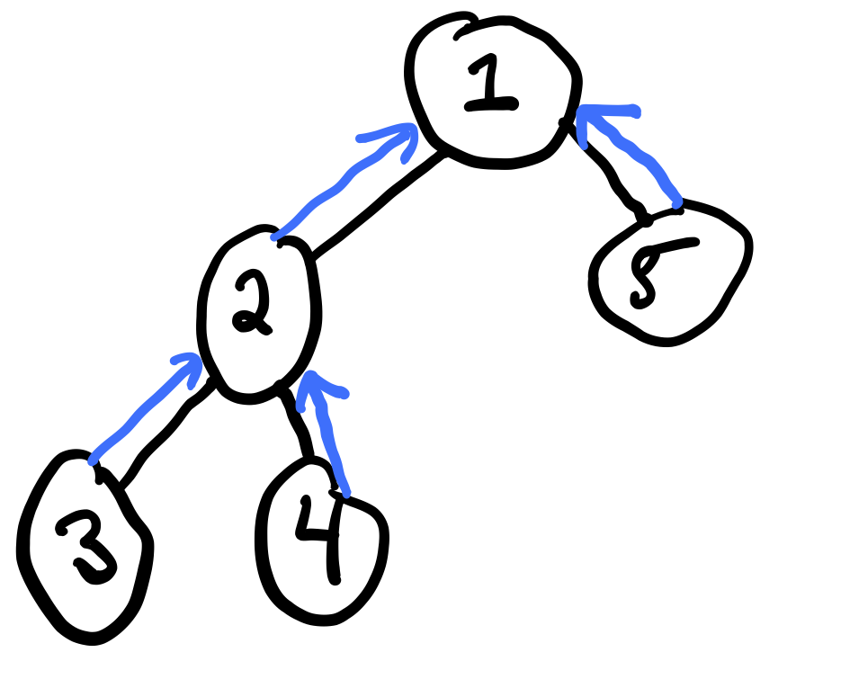
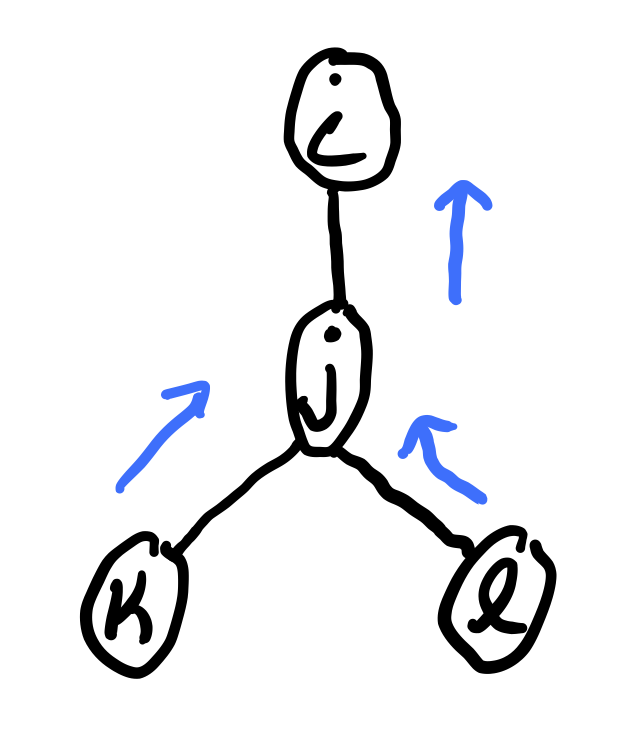

# Week 6: Variational Inference

## Choosing an Elimination Ordering

To choose an elimination ordering, we use a set of heuristics:

- __Min-fill__: the cost of a vertex is the number of edges that need to be added to the graph due to its elimination.
- __Weighted-Min-Fill__: the cost of a vertex is the sum of weights of the edges that need to be added to the graph due to its elimination. Weight of an edge is the product of weights of its constituent vertices.
- __Min-neighbors__: the cost of a vertex is the number of neighbors it has in the current graph.
- __Min-weight__: the cost of a vertex is the product of weights (domain cardinality) of its neighbors.

None of these criteria are _better_ than the others. You often just have to try several.

### Belief Propagation

What if we want \(p(x_i) \ \forall x_i \in X\)? We could run variable elimination for each variable \(x_i\), but this is computationally expensive. Can we do something more efficient?

Consider a tree:

\[
P(X_{1:n}) = \frac{1}{Z} \prod \phi(x_i) \prod_{(i, j) \in T} \phi_{i, j}(x_i, x_j)
\]

We can compute the sum product belief propagation in order to compute all marginals _with just two passes_. Belief propagation is based on **message-passing** of _"messages"_ between neighboring vertices of the graph.

The message sent from variable \(j\) to \(i \in N(j)\) is

\[
m_{j \rightarrow i}(x_i) = \sum_{x_j}\phi_j(x_j)\phi_{ij}(x_i, x_j)\prod_{k \in N(j) \not = i} m_{k \rightarrow j}(x_j)
\]

where each message \(m_{j \rightarrow i}(x_i)\) is a vector with one value for each state of \(x_i\). In order to compute \(m_j \rightarrow m_i\), we must have already computed \(m_k \rightarrow j(x_j)\) for \(k \in \mathcal N(j) \not = i\). Therefore, we need a _specific ordering_ of the messages.

#### Example

Suppose we want to compute \(p(x_1)\) on the graph given above. Choosing an ordering is equivalent to choosing a root. Lets choose \(x_1\) to be the root. Then

\begin{align}
  m_{5 \rightarrow 1}(x_1) &= \sum_{x_5} \phi_5(x_5)\phi_{15}(x_1, x_5) \\
  m_{3 \rightarrow 2}(x_2) &= \sum_{x_3} \phi_3(x_3)\phi_{23}(x_2, x_3) \\
  m_{4 \rightarrow 2}(x_2) &= \sum_{x_4} \phi_4(x_4)\phi_{24}(x_2, x_4) \\
\end{align}

and finally,

\[
m_{2 \rightarrow 1}(x_1) = \sum_{x_1} \phi_2(x_2)\phi_{12}(x_1, x_2)m_{3 \rightarrow 2}(x_2)m_{4 \rightarrow 2}(x_2)
\]

so

\[
p(x_1) \propto \phi_1(x_1)m_{2 \rightarrow 1}(x_1)m_{5 \rightarrow 1}(x_1)
\]

where

\[
Z = \sum_{x_1}p(x_1)
\]

Elimination algorithm in trees is equivalent to message passing.

#### Belief Propagation Algorithm

1. Choose root \(r\) arbitrarily
2. Pass messages from leafs to \(r\)
3. Pass messages from \(r\) to leafs
4. Compute

\[
p(x_i) \propto \phi_i(x_i) \prod_{j \in \mathcal N(i)} m_{j \rightarrow i}(x_i), \ \forall_i 
\]
