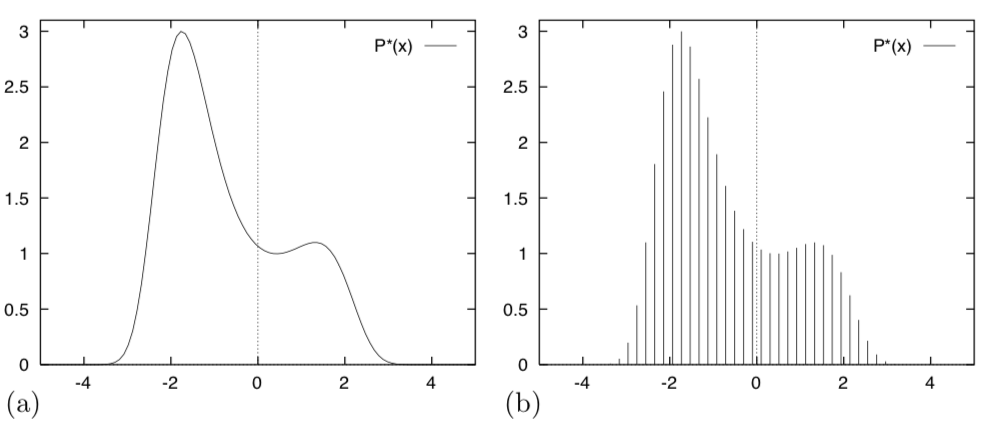
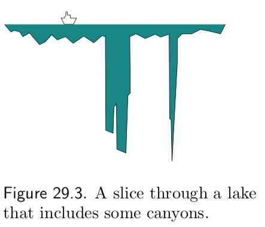

# Week 8: Sampling and Monte Carlo Methods

### Assigned Reading

- MacKay: Chapter 29

### Overview

- Simple Monte Carlo
- Importance Sampling
- Rejection Sampling
- Metropolis Hastings
- Gibbs
- Properties of Markov Chains

We are going to put a pause on variational methods and return to them in a few weeks. Today we will talk about [**sampling**](https://en.wikipedia.org/wiki/Sampling_(statistics)): ways to compute the joint probability in a tractable way.

## Sampling

We will use the word "_sample_" in the following sense: a sample from a distribution \(p(x)\) is a single realization \(x\) whose probability distribution is \(p(x)\). This contrasts with the alternative usage in statistics, where _sample_ refers to a collection of realizations \({x}\).

Recall from last week that we assume the density from which we wish to draw samples, \(p(x)\), can be evaluated to within a multiplicative constant. That is, we can evaluate a function \(\tilde p(x)\) such that

\[
p(x) = \frac{\tilde p(x)}{Z}
\]

## The problems to be solved

[**Monte Carlo methods**](https://en.wikipedia.org/wiki/Monte_Carlo_method) are computational techniques that make use of random numbers. The aims of Monte Carlo methods are to solve one or both of the following problems.

__Problem 1__: To generate samples \(\{x^{(r)}\}^R_{r=1}\) from a given probability distribution \(p(x)\).

__Problem 2__: To estimate expectations of functions, \(\phi(x)\), under this distribution, \(p(x)\)

\[
\Phi = \underset{x \sim p(x)}{\operatorname{\mathbb E}} [\phi(x)] = \int \phi(x)p(x)dx
\]

!!! warning
    \(\phi\) is unrelated to the factors we talked about in week 6; here it is just some function we want to compute the expectation of.

### Simple example

Simple examples of functions \(\phi(x)\) whose expectations we might be interested in include the first and second moments of quantities that we wish to predict, from which we can compute means and variances; for example if some quantity \(t\) depends on \(x\), we can find the mean and variance of \(t\) under \(p(x)\) by finding the expectations of the functions \(\phi_1(x) = t(x)\) and \(\phi_2(x) = (t(x))^2\)

\[
\phi_1(x) = t(x) \Rightarrow \Phi_1 = \underset{x \sim p(x)}{\operatorname{\mathbb E}} [\phi_1(x)] \Rightarrow \text{mean}(t) = \Phi_1 \\
\phi_2(x) = (t(x))^2 \Rightarrow \Phi_2 = \underset{x \sim p(x)}{\operatorname{\mathbb E}} [\phi_2(x)] \Rightarrow \text{var}(t) = \Phi_2 - (\Phi_1)^2 \\
\]

### Simple Monte Carlo

We will concentrate on the first problem (sampling), because if we have solved it, then we can solve the second problem by using the random samples \(\{x^{(r)}\}^R_{r=1}\) to give an estimator. This brings us to __simple Monte Carlo__:

_def_. **Simple Monte Carlo**: Given \(\{x^{(r)}\}^R_{r=1} \sim p(x)\) we estimate the expectation \(\underset{x \sim p(x)}{\operatorname{\mathbb E}} [\phi(x)]\) to be the estimator \(\hat \Phi\)

\[
\Phi = \underset{x \sim p(x)}{\operatorname{\mathbb E}} [\phi(x)] \approx \frac{1}{R}\sum_{r=1}^R \phi(x^{(r)}) = \hat \Phi
\]

#### Properties of MC

If the vectors \(\{x^{(r)}\}^R_{r=1}\) are generated from \(p(x)\) then the expectation of \(\hat \Phi\) is \(\Phi\). E.g. \(\hat \Phi\) is an [unbiased estimator](https://en.wikipedia.org/wiki/Bias_of_an_estimator) of \(\Phi\).

_Proof_

\[
\mathbb E [\hat \Phi]_{x \sim p(\{x^{(r)}\}^R_{r=1})} = \mathbb E \bigg [ \frac{1}{R}\sum_{r=1}^R \phi(x^{(r)}) \bigg ] \\
= \frac{1}{R} \sum_{r=1}^R \mathbb E \big [ \phi(x^{(r)}) \big ]  \\
= \frac{1}{R} \sum_{r=1}^R \underset{x \sim p(x)}{\operatorname{\mathbb E}}  \big [ \phi(x) \big ] \\
= \frac{R}{R} \underset{x \sim p(x)}{\operatorname{\mathbb E}}  \big [ \phi(x) \big ] \\
= \Phi \quad \square
\]

As the number of samples of \(R\) increases, the variance of \(\hat \Phi\) will decrease proportional to \(\frac{1}{R}\)

_Proof_

\[
\text{var}[\hat \Phi] = \text{var} \bigg [ \frac{1}{R}\sum^R_{r=1}\phi(x^{(r)}) \bigg ] \\
= \frac{1}{R^2} \text{var} \bigg [\sum^R_{r=1}\phi(x^{(r)}) \bigg ]\\
= \frac{1}{R^2} \sum^R_{r=1} \text{var} \bigg [\phi(x^{(r)}) \bigg ] \\
= \frac{R}{R^2} \text{var} [\phi(x) ] \\
= \frac{1}{R} \text{var} [\phi(x) ] \quad \square
\]

!!! important
    The accuracy of the Monte Carlo estimate depends only on the variance of \(\phi\), not on the dimensionality of the \(x\). So regardless of the dimensionality of \(x\), it may be that as few as a dozen independent samples \(\{x^{(r)}\}\) suffice to estimate \(\Phi\) satisfactorily.

#### Sampling _p(x)_ is hard

Earlier we said that we will assume we can sample from the density \(p(x)\) to within a multiplicative constant

\[
p(x) = \frac{\tilde p(x)}{Z}
\]

If we can evaluate \(\tilde p(x)\), then why can't we solve problem 1? There are two difficulties

1. We do not typically know the normalizing constant, \(Z\)
2. Even if we did know \(Z\), the problem of drawing samples from \(p(x)\) is still a challenging one, especially in high-dimensional spaces, because there is no obvious way to sample from \(p\) without enumerating most or all of the possible states.

!!! note
    Correct samples from \(p\) will by definition tend to come from places in \(x\)-space where \(p(x)\) is big; how can we identify those places where \(p(x)\) is big, without evaluating \(p(x)\) everywhere? There are only a few high-dimensional densities from which it is easy to draw samples, for example the Gaussian distribution.

First, we will build our intuition for why sampling from \(p\) is difficult. In the next section, will discuss clever Monte Carlo methods can solve them.

##### Bad Idea: Lattice Discretization

Imagine that we wish to draw samples from the density

\[
p(x) = \frac{\tilde p(x)}{Z}
\]

given in figure (a).

Just because we can plot this distribution, that does not mean we can draw samples from it. To start, we don't know the normalizing constant, \(Z\).

!!! warning
    Note the some of these images come from MacKay, who uses a different notation. We use lowercase \(p\) and \(q\) in place of his upper case \(P\) and \(Q\), and we use \(\tilde p\) / \(\tilde q\) in place of his \(p^*\) / \(q^*\).

To simplify the problem, we could discretize the variable \(x\) and sample from the discrete probability distribution over a finite set of uniformly spaced points \(\{x_i\}\) (figure (d)). If we evaluate \(\tilde p(x_i)\) at each point \(x_i\), we could compute

\[
Z = \sum_i \tilde p_i(x_i)
\]

and

\[
p_i = \frac{\tilde p_i}{Z}
\]

and could sample from the probability distribution \(\{p_i\}_{i=1}^R\) using various methods based on a source of random bits. Unfortunately, the cost of this procedure is intractable.

To evaluate \(Z\), we must visit every point in the space. In figure (b) there are \(50\) uniformly spaced points in one dimension. If our system had, \(N=1000\) dimensions say, then the corresponding number of points would be \(50^{N} = 50^{1000}\). Even if each component \(x_n\) took only two discrete values, the number of evaluations of \(\tilde p\) needed to evaluate \(Z\) would take many times longer than the age of the universe.

!!! tip
    **TL;DR** The cost of this lattice discretization method of sampling from \(p(x)\) is exponential in the dimension of our data (e.g. \(D^N\) where \(D\) is the number of data points and \(N\) their dimension).

##### A useful analogy

Imagine the tasks of drawing random water samples from a lake and finding the average plankton concentration (figure 29.2). Let

- \(\tilde p({\bf x})\) = the depth of the lake at \({\bf x} = (x, y)\)
- \(\phi({\bf x})\) = the plankton concentration as a function of \({\bf x}\)
- \(Z\) = the volume of the lake = \(\int \tilde p({\bf x }) d{\bf x }\)

The average concentration of plankton is therefore

\[
\Phi = \frac{1}{Z} \int \phi({\bf x }) \tilde p({\bf x }) d{\bf x }
\]

Say you can take the boat to any desired location \({\bf x }\) on the lake, and can measure the depth, \(\tilde p({\bf x })\), and plankton concentration, \(\phi({\bf x})\), at that point. Therefore,

- __Problem 1__ is to draw water samples at random from the lake, in such a way that each sample is equally likely to come from any point within the lake.
- __Problem 2__ is to find the average plankton concentration.

These are difficult problems to solve because at the outset we know nothing about the depth \(\tilde p({\bf x })\). Perhaps much of the volume of the lake is contained in narrow, deep underwater canyons (figure 29.3), in which case, to correctly sample from the lake and correctly estimate \(\Phi\) our method must implicitly discover the canyons and find their volume relative to the rest of the lake.

## Monte Carlo Methods

### Importance Sampling

[**Importance sampling**](https://en.wikipedia.org/wiki/Importance_sampling) is not a method for generating samples from \(p(x)\) (**Problem 1**); it is just a method for estimating the expectation of a function \(\phi(x)\) (**Problem 2**).

!!! tip
    Importance sampling can be viewed as a generalization of the **uniform sampling** method, something we did not discuss in class but is discussed in MacKay: Chapter 29.

We begin with the same assumption we have made earlier; the density from which we wish to draw samples, \(p(x)\), can be evaluated to within a multiplicative constant. That is, we can evaluate a function \(\tilde p(x)\) such that

\[
p(x) = \frac{\tilde p(x)}{Z}
\]

We further assume we have a simpler density, \(q(x)\) from which it is easy to _sample_ from (i.e. \(x \sim q(x)\)) and easy to _evaluate_ (i.e. \(\tilde q(x)\))

\[
q(x) = \frac{\tilde q(x)}{Z_q}
\]

we call such a density \(q(x)\) the __sampler density__. An example of the functions \(\tilde p, \tilde q\) and \(\phi\) is given in in figure 29.5.

In importance sampling, we generate \(R\) samples from \(q(x)\)

\[
\{x^{(r)}\}^R_{r=1} \sim q(x)
\]

If these points were samples from \(p(x)\) then we could estimate \(\Phi\) by

\[
\Phi = \underset{x \sim p(x)}{\operatorname{\mathbb E}} [\phi(x)] \approx \frac{1}{R}\sum_{r=1}^R \phi(x^{(r)}) = \hat \Phi
\]

That is, we could use a [simple Monte Carlo estimator](#simple-monte-carlo).

But when we generate samples from \(q\), values of \(x\) where \(q(x)\) is greater than \(p(x)\) will be _over-represented_ in this estimator, and points where \(q(x)\) is less than \(p(x)\) will be _under-represented_. To take into account the fact that we have sampled from the wrong distribution, we introduce _weights_.

\[
\tilde w_r = \frac{\tilde p(x^{(r)})}{\tilde q(x^{(r)})}
\]

Finally, we rewrite our estimator under \(q\)

\[
\Phi = \int \phi(x)p(x)dx\\
= \int \phi(x) \cdot \frac{p(x)}{q(x)} \cdot q(x)dx \\
\approx \frac{1}{R}\sum_{r=1}^R \phi(x^{(r)})\frac{p(x^{(r)})}{q(x^{(r)})}
\]

however, the estimator as written still relies on \(p(x)\), we want an estimator that relies on \(\tilde p(x)\)

\begin{align}
&= \frac{Z_q}{Z_p} \frac{1}{R}\sum_{r=1}^R \phi(x^{(r)}) \cdot \frac{\tilde p(x^{(r)})}{\tilde q(x^{(r)})} \\
&= \frac{Z_q}{Z_p} \frac{1}{R}\sum_{r=1}^R \phi(x^{(r)}) \cdot \tilde w_r \\
&= \frac{\frac{1}{R}\sum_{r=1}^R \phi(x^{(r)}) \cdot  \tilde w_r}{\frac{1}{R}\sum_{r=1}^R \tilde w_r} \\
&= \frac{1}{R}\sum_{r=1}^R \phi(x^{(r)}) \cdot  w_r \\
&= \hat \Phi_{iw}
\end{align}

!!! warning
    I don't know where the \(q(x)\) went from line 1 to 2?

where \(\frac{Z_p}{Z_q} = \frac{1}{R}\sum_{r=1}^R \tilde w_r\), \(w_r = \frac{\tilde w_r}{\sum_{r=1}^R \tilde w_r}\) and \(\hat \Phi_{iw}\) is our importance weighted estimator.

!!! note
    \(\hat \Phi_{iw}\) is biased, by consistent.

### Rejection Sampling

In [**rejection sampling**](https://en.wikipedia.org/wiki/Rejection_sampling) we assume again a one-dimensional density \(p(x) = \tilde p(x)/Z\) that is too complicated a function for us to be able to sample from it directly. We assume that we have a simpler __proposal density__ \(q(x)\) which we can evaluate (within a multiplicative factor \(Z_q\), as before), and from which we can generate samples. We further assume that we know the value of a constant \(c\) such that

\[
c \tilde q(x) > \tilde p(x) \quad \forall x
\]

A schematic picture of two such functions is shown below

The procedure is as follows:

1. Generate two random numbers.
    1. The first, \(x\), is generated from the proposal density \(q(x)\).
    2. The second, \(u\) is generated uniformly from the interval \([0, c \tilde q(x)]\) (see figure (b) above).
2. Evaluate \(\tilde p(x)\) and accept or reject the sample \(x\) by comparing the value of \(u\) with the value of \(\tilde p(x)\)
    1. If \(u > \tilde p(x)\), then \(x\) is rejected
    2. Otherwise \(x\) is accepted; \(x\) is added to our set of samples \(\{x^{(r)}\}\) and the value of \(u\) discarded.

Why does this procedure generate samples from \(p(x)\)? The proposed point \((x, u)\) comes with uniform probability from the lightly shaded area underneath the curve \(c \tilde q(x)\) as shown in figure (b) above. The rejection rule rejects all the points that lie above the curve \(\tilde p(x)\). So the points \((x,u)\) that are accepted are uniformly distributed in the heavily shaded area under \(\tilde p(x)\). This implies that the probability density of the x-coordinates of the accepted points must be proportional to \(\tilde p(x)\), so the samples must be independent samples from \(p(x)\).

!!! note
    Rejection sampling will work best if \(q\) is a good approximation to \(p\). If \(q\) is very different from \(p\) then, for \(cq\) to exceed \(p\) everywhere, \(c\) will necessarily have to be large and the frequency of rejection will be large.

#### Rejection sampling in many dimensions

In a high-dimensional problem it is very likely that the requirement that \(c \tilde q\) be an upper bound for \(\tilde p\) will force \(c\) to be so huge that acceptances will be very rare indeed. Finding such a value of \(c\) may be difficult too, since in many problems we know neither where the modes of \(\tilde p\) are located nor how high they are.

In general \(c\) grows exponentially with the dimensionality \(N\), so the acceptance rate is expected to be exponentially small in \(N\)

\[
\text{acceptance rate} = \frac{\text{area under } \tilde p}{\text{area under } c\tilde q} = \frac{1}{Z}
\]

### Metropolis-Hastings method

Importance sampling and rejection sampling work well only if the proposal density \(q(x)\) is similar to \(p(x)\). In high dimensions, it is hard to find one such \(q\).

The **Metropolis–Hastings** algorithm instead makes use of a _proposal density_ \(q\) which depends on the current state \(x^{(t)}\). The density \(q(x' | x^{(t)})\) might be a simple distribution such as a Gaussian centered on the current \(x^{(t)}\), but in general can be _any_ fixed density from which we can draw samples.

In contrast to importance sampling and rejection sampling, it is not necessary \(q(x' | x^{(t)})\) look at all similar to \(p(x)\) in order for the algorithm to be practically useful. An example of a proposal density with two different states (\(x^{(1)}, x^{(2)}\)) is shown in figure 29.10.

As before, we assume we can evaluate \(\tilde p(x)\) for any \(x\). The procedure is as follows:

A tentative new state \(x'\) is generated from the proposal density \(q(x' | x^{(t)})\). To decide whether to accept the new state, we compute

\[
a = \frac{\tilde p(x')q(x^{(t)} | x')}{\tilde p(x^{(t)}) q(x' | x^{(t)})}
\]

- If \(a \ge 1\) then the new state is accepted.
- Otherwise, the new state is accepted with probability \(a\).

    - If accepted, set \(x^{(t + 1)} = x'\). Otherwise, set \(x^{(t + 1)} = x^{(t)}\).

!!! note
    Note the difference from rejection sampling: in rejection sampling, rejected points are discarded and have no influence on the list of samples \(\{x^{(r)}\}\) that we collected. Here, a rejection causes the current state to be written again onto the list.

Metropolis–Hastings converges to \(p(x)\) for any \(q(x' | x^{(t)}) \ge 0 \quad \forall x', x^{(t)}\) as \(t \rightarrow \infty\). That is, our list of samples converges towards the true distribution \(\{x^{(r)}\}_{r=1}^R \rightarrow p(x) \).

There are however, no guarantees on convergence. The Metropolis method is an example of a [Markov chain Monte Carlo method](https://en.wikipedia.org/wiki/Markov_chain_Monte_Carlo) (abbreviated MCMC). In contrast to rejection sampling, where the accepted points \(\{x^{(t)}\}\) are independent samples from the desired distribution, Markov chain Monte Carlo methods involve a Markov process in which a sequence of states \(\{x^{(t)}\}\) is generated, each sample \(x^{(t)}\) having a probability distribution that depends on the previous value, \(x^{(t-1)}\). Since successive samples are dependent, the Markov chain may have to be run for a considerable time in order to generate samples that are effectively independent samples from \(p\).

Just as it was difficult to estimate the variance of an importance sampling estimator, so it is difficult to assess whether a Markov chain Monte Carlo method has ‘converged’, and to quantify how long one has to wait to obtain samples that are effectively independent samples from \(p\).

## Appendix

### Useful Resources

- [Interactive Metropolis Hastings Online Demo](https://chi-feng.github.io/mcmc-demo/app.html#RandomWalkMH,banana)

### Glossary of Terms
