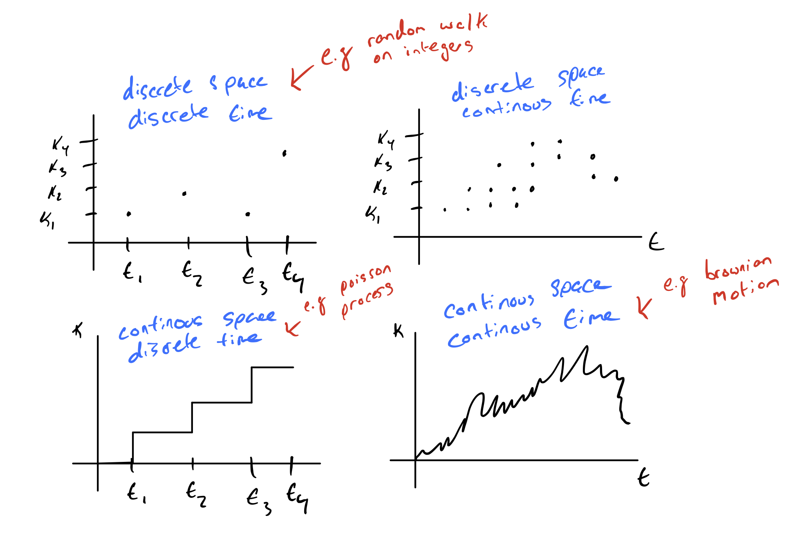

# Week 9: Hidden Markov Models

### Assigned Reading

- Murphy: Chapter 18

### Overview

- Markov Chains
- Hidden Markov Models
- Forward / Backward Algorithm
- Viterbi Algorithm

## Sequential data

Let us turn our attention to sequential data

\[
x_{1:T} = \{x_1, ..., x_T\}
\]

Broadly speaking, **sequential data** can be [time-series](https://en.wikipedia.org/wiki/Time_series) (e.g. stock prices, speech, video analysis) or ordered (e.g. textual data, gene sequences). So far, we have assumed our data to be i.i.d, however this is a poor assumption for sequential data, as there is often clear dependencies between data points.

Recall the general joint factorization via the chain rule

\[
p(x_{1:T}) = \prod_{t=1}^T p(x_t | x_{t-1}, ..., x_1)
\]

But this quickly becomes intractable for high-dimensional data, which is why we made the i.i.d in the first place.

We want temporal dependence without the intractability of computing the chain rule, so we make the simplifying assumption that our data can be modeled as a **first-order [Markov chain](https://en.wikipedia.org/wiki/Markov_chain)**

\[
p(x_t | x_{1:t-1}) = p(x_t | x_{t-1})
\]

!!! tip
    In plain english: each observation is assumed to be independent of all previous observations except most recent.

This assumption greatly simplifies our joint distribution

\[
p(x_{1:T}) = \prod_{t=1}^T p(x_t | x_{t-1})
\]

!!! aside
    Last week we talked about the Markov chain Monte carlo sampling method Metropolis-Hastings. It is called this because the way you draw samples is a Markov chain.

A useful distinction to make at this point is between stationary and non-stationary distributions that generate our data

- **Stationary distribution**: the distribution generating the data does not change through time
- **Non-stationary distribution**: the distribution generating the data is a function of time

We are only going to consider the case of a stationary distribution (because it greatly simplifies the math). In this case, we use the same distribution at every timestep, sometimes called a [homogenous Markov chain](https://en.wikipedia.org/wiki/Markov_chain#Variations). Therefore,

\[
p(x_t | x_{t-1}) \quad \forall t
\]

notice how the process generating the data is independent of \(t\).

### Generalizing to high-order chains

The first-order assumption is still very restrictive. There are many examples where this would be a poor modeling choice (such as when modeling natural language, where long-term dependencies occur often). We can generalize to high-order dependence trivially

_second-order_

\[
p(x_t | x_{1:t-1}) = p(x_t | x_{t-1}, x_{t-2})
\]

\(m\)_-order_

\[
p(x_t | x_{1:t-1}) = p(x_t | x_{t-m:t-1})
\]

#### Parameterization

How does the order of temporal dependence affect the number of parameters in our model?

Assume \(x\) is a discrete random variable with \(k\) states. How many parameters are needed to parameterize

- \(x_t\): \(k-1\), as the last state is implicit.
- _first-order chain_: \(k(k-1)\), as we need \(k\) number of parameters for each parameter of \(x_t\)
- \(m\)_-order chain_: \(k^m(k-1)\), as we need \(k^m\) number of parameters for each parameter of \(x_t\)

!!! tip
    He hinted that this would be useful for assignment 2. Seems like it might be the answer to question 4a.

#### Aside

So far, we have been thinking about models that operate in _discrete space_ and _discrete time_ but we could also think about models that operate in
_continuous space_ or _continuous time_.

## Hidden Markov Models

[**Hidden Markov models (HMMs)**](https://duckduckgo.com/?q=hidden+markov+models&t=ffab&ia=web), make another restrictive assumption: the state of our variables is _fully observed_.

HMMs hide the temporal dependence by keeping it in the _unobserved_ state. No assumptions on the temporal dependence of observations is made. For each observation \(x_t\), we associate a corresponding unobserved hidden/latent variable \(z_t\)

The joint distribution of the model becomes

\[
p(x_{1:T}, z_{1:T}) = p(z_1)\prod_{t=2}^Tp(z_t | z_{t-1})\prod_{t=1}^Tp(x_t | z_t)
\]

Unlike simple Markov chains, the observations are not limited by a Markov assumption of any order. Assuming we have a _homogeneous_ model, we only have to learn three distributions

1. **Initial distribution**: \(\pi(i) = p(z_1 = i)\). The probability of the first hidden variable being in state \(i\) (often denoted \(\pi\))
2. **Transition distribution**: \(T(i, j) = p(z_{t + 1} = j | z_t = i) \quad i \in \{1, ..., k\}\). The probability of moving from hidden state \(i\) to hidden state \(j\).
3. **Emission probability**: \(\varepsilon_i(x) = p(x | z_t = i)\). The probability of an observed random variable \(x\) given the state of the hidden variable that _"emitted"_ it.

### Simple Example

Say we have the following simple chain

where

- \(x_t \in [N, Z, A]\)
- \(z_t \in [H, S]\)

where our observed states are whether or not we are watching Netflix (\(N\)), sleeping (\(Z\)), or working on the assignment (\(A\)) and our hidden states are whether we are happy (\(H\)) or sad (\(S\)). Say futher that we are given the initial (\(\pi\)), transition (\(T\)), and emission probabilities (\(\varepsilon\))

| \(\pi\) |      |
| ------- | ---- |
| H       | 0.70 |
| S       | 0.30 |

| \(\varepsilon\) | N    | Z    | A    |
| --------------- | ---- | ---- | ---- |
| H               | 0.40 | 0.50 | 0.10 |
| S               | 0.10 | 0.30 | 0.60 |

| T   | H    | S    |
| --- | ---- | ---- |
| H   | 0.80 | 0.20 |
| S   | 0.10 | 0.90 |

!!! note
    It is the _rows_ of these tables that need to sum to 1, not the columns!

From these conditional probabilities, we can preform inference with the model, e.g.

\[
p(z_3 = H | z_1 = S) = p(z_3 = H | z_2 = H)p(z_2 = H | z_1 = S) + p(z_3 = H | z_2 = S)p(z_2 = S | z_1 = S) \\
= (0.80)(0.1) + (0.10)(0.90) \\
= 0.17 \\
\]

or

\[
p(x_3 = A | z_1 = S) = p(x_3 = A | z_3 = H)p(z_3 = H | z_1 = S) + p(x_3 = A | z_3 = S)p(z_3 = S | z_1 = S) \\
= (0.10)(0.17) + (0.60)(1 - 0.17) \\
= 0.515
\]

### HMMs Main Task

The main tasks we perform with HMMs are as follows:

__1. Compute the probability of a _latent_ sequence given an _observation_ sequence__

That is, we want to be able to compute \(p(z_{1:t} | x_{1:t})\). This is achieved with the [Forward-Backward algorithm](https://en.wikipedia.org/wiki/Forward%E2%80%93backward_algorithm).

__2. Infer the most likely sequence of hidden states__

That is, we want to be able to compute \(Z^{\star} = \underset{z_{1:T}}{\operatorname{argmax}} p(z_{1:T} | x_{1:T})\). This is achieved using the [Viterbi algorithm](https://en.wikipedia.org/wiki/Viterbi_algorithm).

__3. Learn the parameters__

The parameters of a HMM are typically learned with the [Baum-Welch algorithm](https://en.wikipedia.org/wiki/Baum%E2%80%93Welch_algorithm), a special case of the [Expectation–maximization algorithm](https://en.wikipedia.org/wiki/Expectation%E2%80%93maximization_algorithm) algorithm.

In this course, we will focus on the first two tasks.

### Forward-backward algorithm

The Forward-backward algorithm is used to efficiently estimate the _latent_ sequence given an _observation_ sequence under a HMM. That is, we want to compute

\[
p(z_{t} | x_{1:T}) \quad \forall_t \in [1, T]
\]

assuming that we know the _initial_ \(p(z_1)\), _transition_ \(p(z_t | z_{t-1})\), and _emission_ \(p(x_t | z_t)\) probabilities \(\forall_t \in [1 ,T]\). This task of hidden state inference breaks down into the following:

- **Filtering**: compute posterior over _current_ hidden state, \(p(z_t | x_{1:t})\).
- **Prediction**: compute posterior over _future_ hidden state, \(p(z_{t+k} | x_{1:t})\).
- **Smoothing**: compute posterior over _past_ hidden state, \(p(z_n | x_{1:t}) \quad 1 \lt n \lt t\).

!!! note
    The Forward-backward algorithm is dynamic, i.e. results are stored as they are computed.

Our probability of interest, \(p(z_{t} | x_{1:T})\) is computed using a forward and backward recursion

- **Forward Recursion**: \(p(z_{t} | x_{1:t})\)
- **Backward Recursion**: \(p(x_{1 + t : T} | z_t)\)

We note that

\[
p(z_t | x_{1:T}) \propto p(z_t, x_{1:T}) \\
= p(z_t, x_{1:t})p(x_{t+1:T} | z_t, x_{1:t}) \\
= p(z_t, x_{1:t})p(x_{t+1:T} | z_t) \\
= (\text{Forward Recursion})(\text{Backward Recursion})
\]

!!! note
    The third line is arrived at by noting the conditional independence \(x_{t+1:T} \bot x_{1:t} | z\). If it is not clear why this conditional independence holds, try to draw out the HMM conditioned on \(z_t\).

#### Forward Recursion

\begin{align}
p(z_t, x_{1:t}) &= \sum^k_{z_{t-1} = 1}p(z_{t-1}, z_t, x_{1:t}) \\
&= \sum^k_{z_{t-1} = 1} p(x_t | z_{t-1}, z_t, x_{1:t-1})p(z_t | z_{t-1}, x_{1:t-1})p(z_{t-1}, x_{1:t-1}) \\
&\Rightarrow \alpha_t(z_t) = p(x_t | z_t) \sum^k_{z_{t-1} = 1} p(z_t | z_{t-1}) \alpha_{t-1}(z_{t-1})\\
\end{align}

Notice that our forward recursion contains our emission, \(p(x_t | z_t)\) and transition, \(p(z_t | z_{t-1})\) probabilities. If we recurse all the way down to \(\alpha_1(z_1)\), we get

\[
\alpha_1(z_1) = p(z_1, x_1) = p(z_1)p(x_1 | z_1)
\]

the initial probability times the emission probability of the first observed state, as expected

#### Backward Recursion

\begin{align}
p(x_{t+1:T} | z_t) &= \sum_{z_{t+1}}^k p(z_{t+1}, x_{t+1:T} | z_t) \\
&= \sum_{z_{t+1}}^k p(x_{t+2:T} | z_{t+1}, z_t, x_{t+1})p(x_{t+1} | z_{t+1}, z_t)p(z_{t+1} | z_t) \\
&\Rightarrow \beta_t(z_t) = \sum_{z_{t+1}}^k p(x_{t+2:T} | z_{t+1})p(x_{t+1} | z_{t+1})p(z_{t+1} | z_t) \\
\end{align}

Notice that our backward recursion contains our emission, \(p(x_{t+1} | z_{t+1})\) and transition, \(p(z_{t+1} | z_t)\) probabilities. If we recurse all the way down to \(\beta_1(z_1)\), we get

\[
\beta_1(z_1) = p(x_{3:T} | z_{2})p(x_{2} | z_{2})p(z_{2} | z_1) \\
\]

### Viterbi Algorithm

!!! error
    This will not be on the exam, so I won't bother cleaning up my notes and putting them here!
