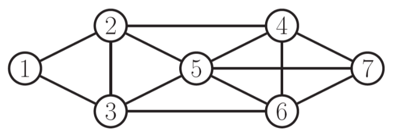

# Sample Final

These are question pulled from the lecture, assignments and the sample midterm, alongside questions that were written based on the study guide. These were _not_ given by an instructor and are merely guesses as to what kind of questions might be on the final.

!!! note
    See the study guide [here](http://www.cs.toronto.edu/~jessebett/CSC412/content/Final_Topics/final_topics.pdf).

## Week 1

## Tutorial 1

### Question 1

Recall that the definition of an exponential family model is:

\[
f(x | \eta) = h(x)g(\eta)\exp(\eta^TT(x))
\]

where

- \(\eta\) are the parameters
- \(T(x)\) are the sufficient statistics
- \(h(x)\) is the base measure
- \(g(\eta)\) is the normalizing constant

Consider the univariate Gaussian, with mean \(\mu\) and precision \(\lambda = \frac{1}{\sigma^2}\)

\[
p(D | \mu \lambda) = \prod^N_{i=1}(\frac{\lambda}{2\pi})^{\frac{1}{2}}\exp(-\frac{\lambda}{2}(x_i - \mu)^2)
\]

What are \(\eta\) and \(T(x)\) for this distribution when represented in exponential family form?

__ANSWER__

Start by expanding the terms in the exponent

\[
= \prod^N_{i=1}(\frac{\lambda}{2\pi})^{\frac{1}{2}} \exp(\sum_{i=1}^N -\frac{\lambda}{2}x_i^2 + \lambda u x_i - \frac{\lambda}{2}\mu^2) \\
\]

from here, we can rearrange the exponent into \(\eta^TT(x)\)

\[
= \prod^N_{i=1}(\frac{\lambda}{2\pi})^{\frac{1}{2}}\exp(\sum_{i=1}^N - \frac{\lambda}{2}\mu^2)\exp(\begin{bmatrix}\lambda u & -\frac{\lambda}{2} & \dotsc & \lambda u & -\frac{\lambda}{2}\end{bmatrix} \begin{bmatrix}x_1 \\ x_1^2 \\ \vdots \\ x_N \\ x_N^2\end{bmatrix}) \\
\]

where

- \(\eta^T = \begin{bmatrix}\lambda u & -\frac{\lambda}{2} & \dotsc & \lambda u & -\frac{\lambda}{2}\end{bmatrix}\)
- \(T(x) = \begin{bmatrix}x_1 \\ x_1^2 \\ \vdots \\ x_N \\ x_N^2\end{bmatrix}\)

## Week 2: Introduction to Probabilistic Models

### Question 1

In this question, we'll fit a naive Bayes model to the MNIST digits using maximum likelihood.
Naive Bayes defines the joint probability of the each datapoint $x$ and its class label $c$ as follows:

\begin{align}
p(x, c | \theta, \pi) = p(c | \pi) p(x | c, \theta_c) = p(c | \pi) \prod_{d=1}^{784} p( x_d | c, \theta_{cd})
\end{align}
For binary data, we can use the Bernoulli likelihood:
\begin{align}
p( x_d | c, \theta_{cd}) = Ber(x_d | \theta_{cd}) = \theta_{cd}^{x_d} ( 1 - \theta_{cd})^{(1 - x_d)}
\end{align}
Which is just a way of expressing that $p(x_d = 1 | c, \theta_{cd}) = \theta_{cd}$.

For $p(c | \pi)$, we can just use a categorical distribution:
\begin{align}
p(c | \pi) = Cat(c|\pi) = \pi_c
\end{align}
Note that we need $\sum_{i=0}^9 \pi_{i} = 1$.

(a) Derive the _maximum likelihood estimate_ (MLE) for the class-conditional pixel means $\theta$. Hint: We saw in lecture that MLE can be thought of as 'counts' for the data, so what should $\hat \theta_{cd}$ be counting?

(b) Derive the _maximum a posteriori_ (MAP) estimate for the class-conditional pixel means $\theta$, using a \(Beta(2, 2)\) prior on each $\theta$.  Hint: it has a simple final form, and you can ignore the Beta normalizing constant.

__ANSWER__

(a) The maximum likelihood estimate of the class-conditional pixel means \(\theta\) for class \(c\) is given by

\[
\hat \theta_c = \operatorname*{argmax}_{\theta_c} \prod_{i=1}^N \prod_{d=1}^{784}\theta^{x_d^{(i)}}_{cd}(1 - \theta_{cd})^{(1-x_d^{(i)})}
\]

where \(N\) is the number of training examples. Taking the log, we get

\begin{align*}
&= \operatorname*{argmax}_{\theta_c} \Bigg [ \sum_{i=1}^N \sum_{d=1}^{784} \log \bigg ( \theta^{x_d^{(i)}}_{cd}(1 - \theta_{cd})^{(1-x_d^{(i)})} \bigg )  \Bigg ] \\
&= \operatorname*{argmax}_{\theta_c}  \Bigg [ \sum_{i=1}^N \sum_{d=1}^{784} x_d^{(i)} \log \theta_{cd} + (1-x_d^{(i)}) \log (1 - \theta_{cd})  \Bigg ] \\
& = \operatorname*{argmax}_{\theta_c} \Bigg [  n_c^{d=1} \cdot \log \theta_{c} + n_c^{d=0} \cdot \log (1 - \theta_{c})  \Bigg ] \\
\end{align*}

where \(n_c^{d=1}\) is a vector of counts containing the number of training examples of class \(c\) where \(d=1\) for each pixel dimension \(d\) in 784, \(n_c^{d=0}\) is the corresponding count vector for the number of training examples of class \(c\) where \(d = 0\), and \(\cdot\) denotes the dot product. Taking the derivative of this expression and setting it to 0, we can solve for the MLE of the parameters

\begin{align*}
\Rightarrow \frac{\partial}{\partial \theta_c}  \bigg [ n_c^{d=1} \cdot \log \theta_{c} + n_c^{d=0} \cdot \log (1 - \theta_{c}) \bigg ] &= 0 \\
\frac{n_c^{d=1}}{\theta_{c}} - \frac{n_c^{d=0}}{1 - \theta_{c}} & = 0
\end{align*}

Rearranging, we get

\[
\hat \theta_c = \frac{n_c^{d=1}}{n_c^{d=1} + n_c^{d=0}} = \frac{n_c^{d=1}}{N}
\]

therefore, the MLE for the class-conditional pixel means \(\theta\) of class \(c\), \(\hat \theta_c\), is given by the number of examples of class \(c\) where \(d=1\) divided by the total number of examples of class \(c\), as expected.

(b) The posterior probability of our class-conditional pixel means, \(\theta\) for class \(c\) is given by

\[
f(\theta_c; \alpha, \beta) = f(\theta_c; 2, 2) = \frac{1}{B(2, 2)}\theta_c^{2 - 1}(1-\theta_c)^{2-1} = \theta_c(1-\theta_c)
\]

\noindent where we have ignored the Beta normalizing constant. The MAP estimate of the class-conditional pixel means \(\theta\) for class \(c\) is given by

\[
\hat \theta_c = \operatorname*{argmax}_{\theta_c} \Bigg [ \theta_c(1-\theta_c) \prod_{i=1}^N \prod_{d=1}^{784} \theta^{x_d^{(i)}}_{cd}(1 - \theta_{cd})^{(1-x_d^{(i)})} \Bigg ]
\]

Taking the log, we get

\begin{align*}
\hat \theta_c &= \operatorname*{argmax}_{\theta_c} \Bigg [ \log \big ( \theta_c(1-\theta_c) \big ) + \sum_{i=1}^N \sum_{d=1}^{784} \log \Bigg ( \theta^{x_d^{(i)}}_{cd}(1 - \theta_{cd})^{(1-x_d^{(i)})} \Bigg ) \Bigg ] \\
&= \operatorname*{argmax}_{\theta_c} \Bigg [ \log(\theta_c) + \log(1-\theta_c) + n_c^{d=1} \cdot \log(\theta_c) + n_c^{d=0} \cdot \log(1 - \theta_c) \Bigg ]
\end{align*}

taking the derivative of this expression and setting it to 0, we can solve for the MAP estimate of the parameters

\begin{align*}
\Rightarrow \frac{\partial}{\partial \theta_c} \bigg [ \log(\theta_c) + \log(1-\theta_c) + n_c^{d=1} \cdot \log(\theta_c) + n_c^{d=0} \cdot \log(1 - \theta_c) \bigg ] &= 0 \\
\frac{1 + n_c^{d=1}}{\theta_c} - \frac{1 + n_c^{d=0}}{(1-\theta_c)} &= 0 \\
\end{align*}

Rearranging, we get

\[
\hat \theta_c = \frac{n_c^{d=1} + 1}{n_c^{d=1} + n_c^{d=0} + 2} = \frac{n_c^{d=1} + 1}{N + 2}
\]

## Week 3: Directed Graphical Models

### Question 1

When we condition on \(y\), are \(x\) and \(z\) independent?

(a)

(b)

(c)

__ANSWER__

(a)

From the graph, we get

\[P(x, y, z) = P(x)P(y|x)P(z|y)\]

which implies

\begin{align}
P(z | x, y) &= \frac{P(x, y, z)}{P(x, y)} \\
&= \frac{P(x)P(y|x)P(z|y)}{P(x)P(y|x)} \\
&= P(z | y) \\
\end{align}

\(\therefore\) \(P(z | x, y) = P(z | y)\) and so by \(\star\star\), \(x \bot z | y\).

(b)

From the graph, we get

\[P(x, y, z) = P(y)P(x|y)P(z|y)\]

which implies

\begin{align}
P(x, z | y) &= \frac{P(x, y, z)}{P(y)} \\
&= \frac{P(y)P(x|y)P(z|y)}{P(y)} \\
&= P(x|y)P(z|y) \\
\end{align}

\(\therefore\) \(P(x, z| y) = P(x|y)P(z|y)\) and so by \(\star\), \(x \bot z | y\).

(c)

From the graph, we get

\[P(x, y, z) = P(x)P(z)P(y|x, z)\]

which implies

\begin{align}
P(z | x, y) &= \frac{P(x)P(z)P(y | x,  z)}{P(x)P(y|x)} \\
&= \frac{P(z)P(y | x,  z)}{P(y|x)}  \\
&\not = P(z|y) \\
\end{align}

\(\therefore\) \(P(z | x, y) \not = P(z|y)\) and so by \(\star\star\), \(x \not \bot z | y\).

In fact, \(x\) and \(z\) are _marginally independent_, but given \(y\) they are _conditionally dependent_. This important effect is called explaining away ([Berkson’s paradox](https://en.wikipedia.org/wiki/Berkson%27s_paradox)).

!!! example
    Imaging flipping two coins independently, represented by events \(x\) and \(z\). Furthermore, let \(y=1\) if the coins come up the same and \(y=0\) if they come up differently. Clearly, \(x\) and \(z\) are independent, but if I tell you \(y\), they become coupled!

### Question 2

(a) In the following graph, is \(x_1 \bot x_6 | \{x_2, x_3\}\)?

(b) In the following graph, is \(x_2 \bot x_3 | \{x_1, x_6\}\)?

__ANSWER__

(a) Yes, by the Bayes Balls algorithm.

(b) No, by the Bayes Balls algorithm.

### Question 3

Consider the following directed graphical model:

(a) List all variables that are independent of \(A\) given evidence on \(B\)

(b) Write down the factorized normalized joint distribution that this graphical model represents.

(c) If each node is a single discrete random variable in \({1, ..., K}\) how many distinct joint states can the model take? That is, how many different configurations can the variables in this model be set?

__ANSWER__

(a) By Bayes' Balls, no variables are conditionally independent of \(A\) given evidence on \(B\).

(b)

\[
p(A, ..., I) = p(A | B, C)P(B | D)P(C | E, F)P(D | G)P(E | G)P(F | H)P(G)P(H)P(I | G, H)
\]

(c) For each node (random variable) there is \(k\) states. There are \(k^n\) possible configurations where \(k\) is the number of states and \(n\) the number of nodes (\(x_{\pi_i}\))

\[
\therefore \text{number of possible configurations} = k^9
\]

### Question 4

Consider the Hidden Markov Model

(a) Assume you are able to sample from these conditional distributions, i.e.

\[
x_i \sim p(X_i \ | \ \text{parents of } X_i)
\]

Write down a step-by-step process to produce a sample observation from this model, i.e. \((x_1, x_2, x_3, ..., x_T)\) in terms of samples from the individual factors.

__ANSWER__

We want to sample a sequence of observations \(x_1, x_2, x_3, ..., x_T\) from the model according to

\[
x_{1:T} = \prod_{t=1}^T p(X_t \ | \ \text{parents of } X_t)
\]

since observations \(x_t\) are independent of one another. Notice that this forms a chain, with probability

\[
p(x_{1:T}) \sim \bigg [ \prod_{t=1}^T p(X_t | z_t) \bigg ] \bigg [ p(z_1) \prod_{t=2}^T p(Z_t | z_{t-1}) \bigg ]
\]

_Step-by-step_

1. Start with \(t=1\)
2. Sample \(z_t\) according to \(z_t \sim p(z_1) \prod_{i=t}^{t + 1} p(Z_i | z_{i-1})\)
3. Given the sampled \(z_t\), sample \(x_t\) according to \(x_t \sim \ p(X_t | z_t)\)
4. Increment \(t\) by 1
5. Repeat steps 2-4 until \(t=T\)

## Week 4: Undirected Graphical Models

### Question 1

Given the following UGM:

(a) State the Global, Local and Pairwise Markov properties.

(b) Use each to give an example of two sets of conditionally independent nodes in the graph.

__ANSWER__

(a)

_def_. **Global Markov Property** (G): \(X_A \bot X_B | X_C\) iff \(X_C\) separates \(X_A\) from \(X_B\)

_def_. **Local Markov Property (Markov Blanket)** (L): The set of nodes that renders a node \(t\) conditionally independent of all the other nodes in the graph

\[
t \bot \mathcal V \setminus cl(t) | mb(t)
\]

_def_. **Pairwise (Markov) Property** (P): The set of nodes that renders two nodes, \(s\) and \(t\), conditionally independent of each other.

\[
s \bot t | \mathcal V \setminus \{s, t\} \Leftrightarrow G_{st} = 0
\]

(b)

- Global: \(\{1, 2\} \bot \{6, 7\} | \{3, 4, 5\}\)
- Local: \(1 \bot \text{rest} | \{2, 3\}\)
- Pairwise: \(1 \bot 7 | \text{rest}\)

## Week 5: Exact Inference
## Week 6
## Week 8: Sampling and Monte Carlo Methods

### Question 1

Given some data \(\{x^{(r)}\}^R_{r=1} \sim p(x)\), the simple Monte Carlo estimator is

\[
\Phi = \mathbb E_{x \sim p(x)}[\phi(x)] \approx \frac{1}{R}\sum_{r=1}^R \phi(x^{(r)}) = \hat \Phi
\]

(a) Show that this estimator is unbiased.

(b) Show that, as the number of samples of \(R\) increases, the variance of \(\hat \Phi\) will decrease proportional to \(\frac{1}{R}\).

__ANSWER__

(a)

\[
\mathbb E [\hat \Phi]_{x \sim p(\{x^{(r)}\}^R_{r=1})} = \mathbb E \bigg [ \frac{1}{R}\sum_{r=1}^R \phi(x^{(r)}) \bigg ] \\
= \frac{1}{R} \sum_{r=1}^R \mathbb E \big [ \phi(x^{(r)}) \big ]  \\
= \frac{1}{R} \sum_{r=1}^R \mathbb E_{x \sim p(x)} \big [ \phi(x) \big ] \\
= \frac{R}{R} \mathbb E_{x \sim p(x)} \big [ \phi(x) \big ] \\
= \Phi \quad \square
\]

(b)

\[
\text{var}[\hat \Phi] = \text{var} \bigg [ \frac{1}{R}\sum^R_{r=1}\phi(x^{(r)}) \bigg ] \\
= \frac{1}{R^2} \text{var} \bigg [\sum^R_{r=1}\phi(x^{(r)}) \bigg ]\\
= \frac{1}{R^2} \sum^R_{r=1} \text{var} \bigg [\phi(x^{(r)}) \bigg ] \\
= \frac{R}{R^2} \text{var} [\phi(x) ] \\
= \frac{1}{R} \text{var} [\phi(x) ] \quad \square
\]

## Week 9: Hidden Markov Models

### Question 1

Say we have the following simple chain

where

- \(x_t \in [N, Z, A]\)
- \(z_t \in [H, S]\)

where our observed states are whether or not we are watching Netflix (\(N\)), sleeping (\(Z\)), or working on the assignment (\(A\)) and our hidden states are whether we are happy (\(H\)) or sad (\(S\)). Say futher that we are given the initial (\(\pi\)), transition (\(T\)), and emission probabilities (\(\varepsilon\))

| \(\pi\) |      |
| ------- | ---- |
| H       | 0.70 |
| S       | 0.30 |

| \(\varepsilon\) | N    | Z    | A    |
| --------------- | ---- | ---- | ---- |
| H               | 0.40 | 0.50 | 0.10 |
| S               | 0.10 | 0.30 | 0.60 |

| T   | H    | S    |
| --- | ---- | ---- |
| H   | 0.80 | 0.20 |
| S   | 0.10 | 0.90 |

!!! note
    It is the _rows_ of these tables that need to sum to 1, not the columns!

From these conditional probabilities, compute

- \(p(z_3 = H | z_1 = S) = ?\)
- \(p(x_3 = A | z_1 = S) = ?\)

__ANSWER__

\[
p(z_3 = H | z_1 = S) = p(z_3 = H | z_2 = H)p(z_2 = H | z_1 = S) + p(z_3 = H | z_2 = S)p(z_2 = S | z_1 = S) \\
= (0.80)(0.1) + (0.10)(0.90) \\
= 0.17 \\
\]

and

\[
p(x_3 = A | z_1 = S) = p(x_3 = A | z_3 = H)p(z_3 = H | z_1 = S) + p(x_3 = A | z_3 = S)p(z_3 = S | z_1 = S) \\
= (0.10)(0.17) + (0.60)(1 - 0.17) \\
= 0.515
\]

### Question 3

__ANSWER__

a) The size of the maximum factor is 3.
b) The size of the maximum clique is 3.
c) The size of the maximum factor is 4.
d) The size of the maximum clique is 4.

## Week 10: Stochastic Variational Inference / Automatic Differentiation Variation Inference (SAD VI)

### Question 1

Starting from the Kullback–Leibler divergence (\(D_{KL}\)), derive the Evidence Lower Bound (ELBO) for a true distribution \(p_\theta (z | x)\) and approximate distribution \(q_\phi(z|x)\) and show that maximizing the ELBO is equivalent to minimizing \(D_{KL}(q_\phi (z | x) || p_\theta (z | x))\).

__ANSWER__

\begin{align}
  D_{KL}(q_\phi (z | x) || p_\theta (z | x)) &= E_{z_\phi \sim q_\phi} \log \frac{q_\phi(z | x)}{p_\theta(z | x)} \\
  &= E_{z_\phi \sim q_\phi} \Bigg [ \log \Bigg ( q_\phi(z | x) \cdot \frac{p_\theta(x)}{p_\theta(z, x)} \Bigg ) \Bigg ] \\
  &= E_{z_\phi \sim q_\phi} \log \frac{q_\phi(z | x)}{p_\theta(z, x)}  + E_{z_\phi \sim q_\phi} \log p_\theta(x) \\
  &= -\mathcal L(\theta, \phi ; x)  + \log p_\theta(x) \\
\end{align}

Where \(\mathcal L(\theta, \phi ; x)\) is the **ELBO**. Rearranging,

\begin{align}
  D_{KL}(q_\phi (z | x) || p_\theta (z | x)) &= -\mathcal L(\theta, \phi ; x)  + \log p_\theta(x) \\
  \Rightarrow \mathcal L(\theta, \phi ; x) + D_{KL}(q_\phi (z | x) || p_\theta (z | x)) &= \log p_\theta(x) \\
\end{align}

because \(D_{KL}(q_\phi (z | x) || p_\theta (z | x)) \ge 0\)

\[
\mathcal L(\theta, \phi ; x) \le \log p_\theta(x)
\]

\(\therefore\) maximizing the ELBO \(\Rightarrow\) minimizing \(D_{KL}(q_\phi (z | x) || p_\theta (z | x))\).
