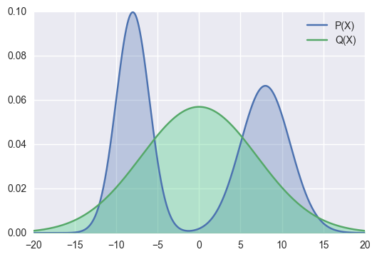
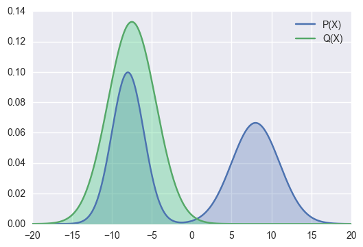

# Sample Final

These are question pulled from the lecture, assignments and the sample midterm, alongside questions that were written based on the study guide. These were _not_ given by an instructor and are merely guesses as to what kind of questions might be on the final.

!!! note
    See the study guide [here](http://www.cs.toronto.edu/~jessebett/CSC412/content/Final_Topics/final_topics.pdf).

## Week 1

## Tutorial 1

### Question 1

Recall that the definition of an exponential family model is:

\[
f(x | \eta) = h(x)g(\eta)\exp(\eta^TT(x))
\]

where

- \(\eta\) are the parameters
- \(T(x)\) are the sufficient statistics
- \(h(x)\) is the base measure
- \(g(\eta)\) is the normalizing constant

Consider the univariate Gaussian, with mean \(\mu\) and precision \(\lambda = \frac{1}{\sigma^2}\)

\[
p(D | \mu \lambda) = \prod^N_{i=1}(\frac{\lambda}{2\pi})^{\frac{1}{2}}\exp(-\frac{\lambda}{2}(x_i - \mu)^2)
\]

What are \(\eta\) and \(T(x)\) for this distribution when represented in exponential family form?

__ANSWER__

Start by expanding the terms in the exponent

\[
= \prod^N_{i=1}(\frac{\lambda}{2\pi})^{\frac{1}{2}} \exp(\sum_{i=1}^N -\frac{\lambda}{2}x_i^2 + \lambda u x_i - \frac{\lambda}{2}\mu^2) \\
\]

from here, we can rearrange the exponent into \(\eta^TT(x)\)

\[
= \prod^N_{i=1}(\frac{\lambda}{2\pi})^{\frac{1}{2}}\exp(\sum_{i=1}^N - \frac{\lambda}{2}\mu^2)\exp(\begin{bmatrix}\lambda u & -\frac{\lambda}{2} & \dotsc & \lambda u & -\frac{\lambda}{2}\end{bmatrix} \begin{bmatrix}x_1 \\ x_1^2 \\ \vdots \\ x_N \\ x_N^2\end{bmatrix}) \\
\]

where

- \(\eta^T = \begin{bmatrix}\lambda u & -\frac{\lambda}{2} & \dotsc & \lambda u & -\frac{\lambda}{2}\end{bmatrix}\)
- \(T(x) = \begin{bmatrix}x_1 \\ x_1^2 \\ \vdots \\ x_N \\ x_N^2\end{bmatrix}\)

## Week 2: Introduction to Probabilistic Models

### Question 1

In this question, we'll fit a naive Bayes model to the MNIST digits using maximum likelihood.
Naive Bayes defines the joint probability of the each datapoint $x$ and its class label $c$ as follows:

\begin{align}
p(x, c | \theta, \pi) = p(c | \pi) p(x | c, \theta_c) = p(c | \pi) \prod_{d=1}^{784} p( x_d | c, \theta_{cd})
\end{align}
For binary data, we can use the Bernoulli likelihood:
\begin{align}
p( x_d | c, \theta_{cd}) = Ber(x_d | \theta_{cd}) = \theta_{cd}^{x_d} ( 1 - \theta_{cd})^{(1 - x_d)}
\end{align}
Which is just a way of expressing that $p(x_d = 1 | c, \theta_{cd}) = \theta_{cd}$.

For $p(c | \pi)$, we can just use a categorical distribution:
\begin{align}
p(c | \pi) = Cat(c|\pi) = \pi_c
\end{align}
Note that we need $\sum_{i=0}^9 \pi_{i} = 1$.

(a) Derive the _maximum likelihood estimate_ (MLE) for the class-conditional pixel means $\theta$. Hint: We saw in lecture that MLE can be thought of as 'counts' for the data, so what should $\hat \theta_{cd}$ be counting?

(b) Derive the _maximum a posteriori_ (MAP) estimate for the class-conditional pixel means $\theta$, using a \(Beta(2, 2)\) prior on each $\theta$.  Hint: it has a simple final form, and you can ignore the Beta normalizing constant.

__ANSWER__

(a) The maximum likelihood estimate of the class-conditional pixel means \(\theta\) for class \(c\) is given by

\[
\hat \theta_c = \operatorname*{argmax}_{\theta_c} \prod_{i=1}^N \prod_{d=1}^{784}\theta^{x_d^{(i)}}_{cd}(1 - \theta_{cd})^{(1-x_d^{(i)})}
\]

where \(N\) is the number of training examples. Taking the log, we get

\begin{align*}
&= \operatorname*{argmax}_{\theta_c} \Bigg [ \sum_{i=1}^N \sum_{d=1}^{784} \log \bigg ( \theta^{x_d^{(i)}}_{cd}(1 - \theta_{cd})^{(1-x_d^{(i)})} \bigg )  \Bigg ] \\
&= \operatorname*{argmax}_{\theta_c}  \Bigg [ \sum_{i=1}^N \sum_{d=1}^{784} x_d^{(i)} \log \theta_{cd} + (1-x_d^{(i)}) \log (1 - \theta_{cd})  \Bigg ] \\
& = \operatorname*{argmax}_{\theta_c} \Bigg [  n_c^{d=1} \cdot \log \theta_{c} + n_c^{d=0} \cdot \log (1 - \theta_{c})  \Bigg ] \\
\end{align*}

where \(n_c^{d=1}\) is a vector of counts containing the number of training examples of class \(c\) where \(d=1\) for each pixel dimension \(d\) in 784, \(n_c^{d=0}\) is the corresponding count vector for the number of training examples of class \(c\) where \(d = 0\), and \(\cdot\) denotes the dot product. Taking the derivative of this expression and setting it to 0, we can solve for the MLE of the parameters

\begin{align*}
\Rightarrow \frac{\partial}{\partial \theta_c}  \bigg [ n_c^{d=1} \cdot \log \theta_{c} + n_c^{d=0} \cdot \log (1 - \theta_{c}) \bigg ] &= 0 \\
\frac{n_c^{d=1}}{\theta_{c}} - \frac{n_c^{d=0}}{1 - \theta_{c}} & = 0
\end{align*}

Rearranging, we get

\[
\hat \theta_c = \frac{n_c^{d=1}}{n_c^{d=1} + n_c^{d=0}} = \frac{n_c^{d=1}}{N}
\]

therefore, the MLE for the class-conditional pixel means \(\theta\) of class \(c\), \(\hat \theta_c\), is given by the number of examples of class \(c\) where \(d=1\) divided by the total number of examples of class \(c\), as expected.

(b) The prior probability of our class-conditional pixel means, \(\theta\) for class \(c\) is given by

\[
f(\theta_c; \alpha, \beta) = f(\theta_c; 2, 2) = \frac{1}{B(2, 2)}\theta_c^{2 - 1}(1-\theta_c)^{2-1} = \theta_c(1-\theta_c)
\]

where we have ignored the Beta normalizing constant. The MAP estimate of the class-conditional pixel means \(\theta\) for class \(c\) is given by

\[
\hat \theta_c = \operatorname*{argmax}_{\theta_c} \Bigg [ \theta_c(1-\theta_c) \prod_{i=1}^N \prod_{d=1}^{784} \theta^{x_d^{(i)}}_{cd}(1 - \theta_{cd})^{(1-x_d^{(i)})} \Bigg ]
\]

Taking the log, we get

\begin{align*}
\hat \theta_c &= \operatorname*{argmax}_{\theta_c} \Bigg [ \log \big ( \theta_c(1-\theta_c) \big ) + \sum_{i=1}^N \sum_{d=1}^{784} \log \Bigg ( \theta^{x_d^{(i)}}_{cd}(1 - \theta_{cd})^{(1-x_d^{(i)})} \Bigg ) \Bigg ] \\
&= \operatorname*{argmax}_{\theta_c} \Bigg [ \log(\theta_c) + \log(1-\theta_c) + n_c^{d=1} \cdot \log(\theta_c) + n_c^{d=0} \cdot \log(1 - \theta_c) \Bigg ]
\end{align*}

taking the derivative of this expression and setting it to 0, we can solve for the MAP estimate of the parameters

\begin{align*}
\Rightarrow \frac{\partial}{\partial \theta_c} \bigg [ \log(\theta_c) + \log(1-\theta_c) + n_c^{d=1} \cdot \log(\theta_c) + n_c^{d=0} \cdot \log(1 - \theta_c) \bigg ] &= 0 \\
\frac{1 + n_c^{d=1}}{\theta_c} - \frac{1 + n_c^{d=0}}{(1-\theta_c)} &= 0 \\
\end{align*}

Rearranging, we get

\[
\hat \theta_c = \frac{n_c^{d=1} + 1}{n_c^{d=1} + n_c^{d=0} + 2} = \frac{n_c^{d=1} + 1}{N + 2}
\]

## Week 3: Directed Graphical Models

### Question 1

When we condition on \(y\), are \(x\) and \(z\) independent?

(a)

(b)

(c)

__ANSWER__

(a)

From the graph, we get

\[P(x, y, z) = P(x)P(y|x)P(z|y)\]

which implies

\begin{align}
P(z | x, y) &= \frac{P(x, y, z)}{P(x, y)} \\
&= \frac{P(x)P(y|x)P(z|y)}{P(x)P(y|x)} \\
&= P(z | y) \\
\end{align}

\(\therefore\) \(P(z | x, y) = P(z | y)\) and so by \(\star\star\), \(x \bot z | y\).

(b)

From the graph, we get

\[P(x, y, z) = P(y)P(x|y)P(z|y)\]

which implies

\begin{align}
P(x, z | y) &= \frac{P(x, y, z)}{P(y)} \\
&= \frac{P(y)P(x|y)P(z|y)}{P(y)} \\
&= P(x|y)P(z|y) \\
\end{align}

\(\therefore\) \(P(x, z| y) = P(x|y)P(z|y)\) and so by \(\star\), \(x \bot z | y\).

(c)

From the graph, we get

\[P(x, y, z) = P(x)P(z)P(y|x, z)\]

which implies

\begin{align}
P(z | x, y) &= \frac{P(x)P(z)P(y | x,  z)}{P(x)P(y|x)} \\
&= \frac{P(z)P(y | x,  z)}{P(y|x)}  \\
&\not = P(z|y) \\
\end{align}

\(\therefore\) \(P(z | x, y) \not = P(z|y)\) and so by \(\star\star\), \(x \not \bot z | y\).

In fact, \(x\) and \(z\) are _marginally independent_, but given \(y\) they are _conditionally dependent_. This important effect is called explaining away ([Berkson’s paradox](https://en.wikipedia.org/wiki/Berkson%27s_paradox)).

!!! example
    Imaging flipping two coins independently, represented by events \(x\) and \(z\). Furthermore, let \(y=1\) if the coins come up the same and \(y=0\) if they come up differently. Clearly, \(x\) and \(z\) are independent, but if I tell you \(y\), they become coupled!

### Question 2

(a) In the following graph, is \(x_1 \bot x_6 | \{x_2, x_3\}\)?

(b) In the following graph, is \(x_2 \bot x_3 | \{x_1, x_6\}\)?

__ANSWER__

(a) Yes, by the Bayes Balls algorithm.

(b) No, by the Bayes Balls algorithm.

### Question 3

Consider the following directed graphical model:

(a) List all variables that are independent of \(A\) given evidence on \(B\)

(b) Write down the factorized normalized joint distribution that this graphical model represents.

(c) If each node is a single discrete random variable in \({1, ..., K}\) how many distinct joint states can the model take? That is, how many different configurations can the variables in this model be set?

__ANSWER__

(a) By Bayes' Balls, no variables are conditionally independent of \(A\) given evidence on \(B\).

(b)

\[
p(A, ..., I) = p(A | B, C)P(B | D)P(C | E, F)P(D | G)P(E | G)P(F | H)P(G)P(H)P(I | G, H)
\]

(c) For each node (random variable) there is \(k\) states. There are \(k^n\) possible configurations where \(k\) is the number of states and \(n\) the number of nodes (\(x_{\pi_i}\))

\[
\therefore \text{number of possible configurations} = k^9
\]

### Question 4

Consider the Hidden Markov Model

(a) Assume you are able to sample from these conditional distributions, i.e.

\[
x_i \sim p(X_i \ | \ \text{parents of } X_i)
\]

Write down a step-by-step process to produce a sample observation from this model, i.e. \((x_1, x_2, x_3, ..., x_T)\) in terms of samples from the individual factors.

__ANSWER__

We want to sample a sequence of observations \(x_1, x_2, x_3, ..., x_T\) from the model according to

\[
x_{1:T} \sim \prod_{t=1}^T p(X_t \ | \ \text{parents of } X_t)
\]

since observations \(x_t\) are independent of one another. Notice that this forms a chain, with probability

\[
p(x_{1:T}) \sim \bigg [ \prod_{t=1}^T p(X_t | z_t) \bigg ] \bigg [ p(z_1) \prod_{t=2}^T p(Z_t | z_{t-1}) \bigg ]
\]

_Step-by-step_

1. Start with \(t=1\)
2. Sample \(z_t\) according to \(z_t \sim p(z_1) \prod_{i=2}^{t} p(Z_i | z_{i-1})\)
3. Given the sampled \(z_t\), sample \(x_t\) according to \(x_t \sim \ p(X_t | z_t)\)
4. Increment \(t\) by 1
5. Repeat steps 2-4 until \(t=T\)

## Week 4: Undirected Graphical Models

### Question 1

(a) State the Global, Local and Pairwise Markov properties used to determine conditional independence in a undirected graphical model.

Given the following UGMs:

(b)

(c)

use each to Markov property to give an example of two sets of conditionally independent nodes in the graph.

__ANSWER__

(a)

_def_. **Global Markov Property** (G): \(X_A \bot X_B | X_C\) iff \(X_C\) separates \(X_A\) from \(X_B\)

_def_. **Local Markov Property (Markov Blanket)** (L): The set of nodes that renders a node \(t\) conditionally independent of all the other nodes in the graph

\[
t \bot \mathcal V \setminus cl(t) | mb(t)
\]

_def_. **Pairwise (Markov) Property** (P): The set of nodes that renders two nodes, \(s\) and \(t\), conditionally independent of each other.

\[
s \bot t | \mathcal V \setminus \{s, t\} \Leftrightarrow G_{st} = 0
\]

(b)

- Global: \(\{1, 2\} \bot \{6, 7\} | \{3, 4, 5\}\)
- Local: \(1 \bot \text{rest} | \{2, 3\}\)
- Pairwise: \(1 \bot 7 | \text{rest}\)

(c)

- Global: \(\{X_1, X_2\} \bot \{X_{15}, X_{20}\} | \{X_3, X_6, X_7\}\)
- Local: \(1 \bot \text{rest} | \{X_2, X_6\}\)
- Pairwise: \(1 \bot 20 | \text{rest}\)

### Question 2

Given the following graph:

(a) What is a _maximal_ clique? State one example from the graph.

(b) What is a _maximum_ clique? State on example from the graph.

(c) Write down the factorized joint distribution that this graphical model represents

__ANSWER__

(a)

_def_. A [**maximal clique**](https://en.wikipedia.org/wiki/Clique_(graph_theory)#Definitions) is a clique that cannot be extended by including one more adjacent vertex.

_def_. A [**maximum clique**](https://en.wikipedia.org/wiki/Clique_(graph_theory)#Definitions) is a clique of the _largest possible size_ in a given graph.

(b)

A _maximal clique_ is show in blue, while a _maximum clique_ is shown in green.

(c)

\[
p(x_1, ..., x_7) \propto \psi_{1, 2, 3}(x_1, x_2, x_3) \psi_{2, 3, 5}(x_2, x_3, x_5) \psi_{2, 4, 5}(x_2, x_4, x_5) \psi_{3, 5, 6}(x_3, x_5, x_6) \psi_{4, 5, 6, 7}(x_4, x_5, x_6, x_7)
\]

### Question 3

Compare and contrast directed vs undirected graphical models:

__ANSWER__

|                               | DGMs                                                              | UGMs                                                                           |
| ----------------------------- | ----------------------------------------------------------------- | ------------------------------------------------------------------------------ |
| Represented by                | Directed graph                                                    | Undirected Graphs                                                              |
| Nodes specify                 | Random variables                                                  | Random variables                                                               |
| Edges specify                 | Conditional dependence between variables                          | Probabilistic interactions                                                     |
| Graph factorizes according to | Local conditional probabilities                                   | Potential functions (or factors), one per maximal clique       |
| Parameterized by              | Conditional probability tables (if random variables are discrete) | Tables of non-negative, relative affinities (if random variables are discrete) |

## Week 5: Exact Inference

### Question 1

Given the graph

(a) Suppose we want to compute the partition function (\(Z(\theta)\), see [here](../lectures/week_4/#parameterization-of-an-ugm)) using the elimination ordering \(\prec= (1, 2, 3, 4, 5, 6)\). If we use the [variable elimination algorithm](../lectures/week_5/#variable-elimination), we will create new intermediate factors. What is the largest intermediate factor?

(b) Add an edge to the original MRF between every pair of variables that end up in the same factor (These are called fill in edges.) Draw the resulting MRF. What is the size of the largest maximal clique in this graph?

(c) Now consider elimination ordering \(\prec= (4, 1, 2, 3, 5, 6)\). If we use the [variable elimination algorithm](../lectures/week_5/#variable-elimination), we will create new intermediate factors. What is the largest intermediate factor?

(d) Add an edge to the original MRF between every pair of variables that end up in the same factor (These are called fill in edges.) Draw the resulting MRF. What is the size of the largest maximal clique in this graph?

__ANSWER__

a) The size of the maximum factor is 3.

The set of potentials given by the graph is

\[
\Psi = \{\psi_{X_1, X_2}(X_1, X_2), \psi_{X_1, X_3}(X_1, X_3), \psi_{X_2, X_4}(X_2, X_4), \psi_{X_3, X_4}(X_3, X_4), \psi_{X_4, X_5}(X_4, X_5), \psi_{X_5, X_6}(X_5, X_6) \}
\]

and the joint probability is therefore

\[
p(X_1, ..., X_6) \propto \psi_{X_1, X_2}(X_1, X_2)\psi_{X_1, X_3}(X_1, X_3)\psi_{X_2, X_4}(X_2, X_4)\psi_{X_3, X_4}(X_3, X_4)\psi_{X_4, X_5}(X_4, X_5)\psi_{X_5, X_6}(X_5, X_6)
\]

finally, the partition function with elimination ordering \(\prec= (1, 2, 3, 4, 5, 6)\) is given by

\begin{align}
\tau(X) &= \sum_z \prod_{\psi \in \Psi} \psi(z_{Scope[\psi] \cap Z}, x_{Scope[\psi] \cap X}) \\
&= \sum_{x_6}\sum_{x_5}\sum_{x_4}\sum_{x_3}\sum_{x_2}\sum_{x_1} \psi_{X_1, X_2}(X_1, X_2)\psi_{X_1, X_3}(X_1, X_3)\psi_{X_2, X_4}(X_2, X_4)\psi_{X_3, X_4}(X_3, X_4)\psi_{X_4, X_5}(X_4, X_5)\psi_{X_5, X_6}(X_5, X_6)
\end{align}

Carrying out the elimination, (not shown here), we get intermediate factors

\[
\{\tau_1(x_2, x_3), \tau_2(x_3, x_4), \tau_3(x_4), \tau_4(x_5), \tau_5(x_6)\}
\]

\(\therefore\) the maximum factor is of size 3.

b) The only edge that does not already exist is the edge between \(X_2\) and \(X_3\) (added by intermediate factor \(\tau_1(x_2, x_3)\)). The largest maximal clique is now of size 3 (\(\{x_2, x_3, x_4\}\)).

(c)

The partition function with elimination ordering \(\prec= (4, 1, 2, 3, 5, 6)\) is given by

\begin{align}
\tau(X) &= \sum_z \prod_{\psi \in \Psi} \psi(z_{Scope[\psi] \cap Z}, x_{Scope[\psi] \cap X}) \\
&= \sum_{x_6}\sum_{x_5}\sum_{x_3}\sum_{x_2}\sum_{x_1}\sum_{x_4} \psi_{X_1, X_2}(X_1, X_2)\psi_{X_1, X_3}(X_1, X_3)\psi_{X_2, X_4}(X_2, X_4)\psi_{X_3, X_4}(X_3, X_4)\psi_{X_4, X_5}(X_4, X_5)\psi_{X_5, X_6}(X_5, X_6)
\end{align}

Carrying out the elimination, (not shown here), we get intermediate factors

\[
\{\tau_1(x_2, x_3, x_5), \tau_2(x_2, x_3, x_5), \tau_3(x_3, x_5), \tau_4(x_5), \tau_5(x_6)\}
\]

\(\therefore\) the maximum factor is of size 4.

d) The added edges are between

- \(X_2\) and \(X_3\) (added by intermediate factors \(\tau_1(x_2, x_3, x_5)\) / \(\tau_2(x_2, x_3, x_5)\))
- \(X_2\) and \(X_5\) (added by intermediate factors \(\tau_1(x_2, x_3, x_5)\) / \(\tau_2(x_2, x_3, x_5)\))
- \(X_3\) and \(X_5\) (added by intermediate factors \(\tau_1(x_2, x_3, x_5)\) , \(\tau_2(x_2, x_3, x_5)\), \(\tau_3(x_3, x_5)\))

The largest maximal clique is now of size 4 (\(\{x_2, x_3, x_4, x_5\}\)).

## Week 6

### Question 1

Imagine that we have two distributions: the true distribution \(P(x)\), and the approximate distribution \(Q(x)\). Say further that we are trying to minimize the KL-Divergence between the true and approximate distribution.

Explain the difference between the _forward_

\[
D_{KL}(P(X) || Q(X)) = \int P(x) \log \frac{P(x)}{Q(x)}
\]

and _reverse_

\[
D_{KL}(Q(X) || P(X)) = \int Q(x) \log \frac{Q(x)}{P(x)}
\]

 KL-Divergence for these two distributions.

__ANSWER__

In the **forward KL-Divergence**, the difference between two distributions \(P(X)\) and \(Q(x)\) is weighted by \(P(x)\)

\[
D_{KL}(P(X) || Q(X)) = \int P(x) \log \frac{P(x)}{Q(x)}
\]

The optimization procedure only penalizes a difference in density between \(P(x)\) and \(Q(x)\) for regions where \(P(x) > 0\). A difference in density between \(Q(x)\) and \(P(x)\) do not contribute to the KL-Divergence when \(P(x) = 0\).

For this reason, the forward KL-Divergence is referred to as _zero-avoiding_ as it is avoiding \(Q(x) = 0\) whenever \(P(x) > 0\).

In the **backward KL-Divergence**, the difference between two distributions \(P(X)\) and \(Q(x)\) is weighted by \(Q(x)\)

\[
D_{KL}(Q(X) || P(X)) = \int Q(x) \log \frac{Q(x)}{P(x)}
\]

The optimization procedure only penalizes a difference in density between \(P(x)\) and \(Q(x)\) for regions where \(Q(x) > 0\). A difference in density between \(Q(x)\) and \(P(x)\) does not contribute to the KL-Divergence when \(Q(x) = 0\).

For this reason, the forward KL-Divergence is referred to as _zero-forcing_ as it forces \(Q(x)\) to be 0 on some areas, even if \(P(x)>0\).

!!! cite
    Images came from [this](https://wiseodd.github.io/techblog/2016/12/21/forward-reverse-kl/) blog.

## Week 8: Sampling and Monte Carlo Methods

### Question 1

Given some data \(\{x^{(r)}\}^R_{r=1} \sim p(x)\), the simple Monte Carlo estimator is

\[
\Phi = \mathbb E_{x \sim p(x)}[\phi(x)] \approx \frac{1}{R}\sum_{r=1}^R \phi(x^{(r)}) = \hat \Phi
\]

(a) Show that this estimator is unbiased.

(b) Show that, as the number of samples of \(R\) increases, the variance of \(\hat \Phi\) will decrease proportional to \(\frac{1}{R}\).

__ANSWER__

(a) To show that \(\hat \Phi\) is an unbiased estimator of \(\Phi\) we must show that for random samples \(\{x^{(r)}\}^R_{r=1}\) generated from \(p(x)\), the expectation of \(\hat \Phi\) is \(\Phi\):

\[
\mathbb E [\hat \Phi]_{x \sim p(\{x^{(r)}\}^R_{r=1})} = \mathbb E \bigg [ \frac{1}{R}\sum_{r=1}^R \phi(x^{(r)}) \bigg ] \\
= \frac{1}{R} \sum_{r=1}^R \mathbb E \big [ \phi(x^{(r)}) \big ]  \\
= \frac{1}{R} \sum_{r=1}^R \underset{x \sim p(x)}{\operatorname{\mathbb E}}  \big [ \phi(x) \big ] \\
= \frac{R}{R} \underset{x \sim p(x)}{\operatorname{\mathbb E}}  \big [ \phi(x) \big ] \\
= \Phi \quad \square
\]

(b)

\[
\text{var}[\hat \Phi] = \text{var} \bigg [ \frac{1}{R}\sum^R_{r=1}\phi(x^{(r)}) \bigg ] \\
= \frac{1}{R^2} \text{var} \bigg [\sum^R_{r=1}\phi(x^{(r)}) \bigg ]\\
= \frac{1}{R^2} \sum^R_{r=1} \text{var} \bigg [\phi(x^{(r)}) \bigg ] \\
= \frac{R}{R^2} \text{var} [\phi(x) ] \\
= \frac{1}{R} \text{var} [\phi(x) ] \quad \square
\]

### Question 2

Starting from \(\Phi = \int \phi(x)p(x)dx\), derive the importance weighted estimator \(\hat \Phi_{iw}\) given

\[
\tilde w_r = \frac{\tilde p(x^{(r)})}{\tilde q(x^{(r)})}
\]

__ANSWER__

\begin{align}
\Phi &= \int \phi(x)p(x)dx \\
&= \int \phi(x) \cdot \frac{p(x)}{q(x)} \cdot q(x)dx \\
&\approx \frac{1}{R}\sum_{r=1}^R \phi(x^{(r)})\frac{p(x^{(r)})}{q(x^{(r)})} \\
&= \frac{Z_q}{Z_p} \frac{1}{R}\sum_{r=1}^R \phi(x^{(r)}) \cdot \frac{\tilde p(x^{(r)})}{\tilde q(x^{(r)})} \\
&= \frac{Z_q}{Z_p} \frac{1}{R}\sum_{r=1}^R \phi(x^{(r)}) \cdot \tilde w_r \\
&= \frac{\frac{1}{R}\sum_{r=1}^R \phi(x^{(r)}) \cdot  \tilde w_r}{\frac{1}{R}\sum_{r=1}^R \tilde w_r} \\
&= \frac{1}{R}\sum_{r=1}^R \phi(x^{(r)}) \cdot  w_r \\
&= \hat \Phi_{iw}
\end{align}

where \(\frac{Z_p}{Z_q} = \frac{1}{R}\sum_{r=1}^R \tilde w_r\), \(w_r = \frac{\tilde w_r}{\sum_{r=1}^R \tilde w_r}\) and \(\hat \Phi_{iw}\) is our importance weighted estimator.

## Week 9: Hidden Markov Models

### Question 1

Assume \(x\) is a discrete random variable with \(k\) states. How many parameters are needed to parameterize

(a) \(x_t\)?

(b) A _first-order_ Markov chain?

(c) An \(m\)_-ordered_ Markov chain?

__ANSWER__

(a) \(k-1\), as the last state is implicit.

(b) \(k(k-1)\), as we need \(k\) number of parameters for each parameter of \(x_t\)

(c) \(k^m(k-1)\), as we need \(k^m\) number of parameters for each parameter of \(x_t\)

### Question 2

Say we have the following simple chain

where

- \(x_t \in [N, Z, A]\)
- \(z_t \in [H, S]\)

where our observed states are whether or not we are watching Netflix (\(N\)), sleeping (\(Z\)), or working on the assignment (\(A\)) and our hidden states are whether we are happy (\(H\)) or sad (\(S\)). Say futher that we are given the initial (\(\pi\)), transition (\(T\)), and emission probabilities (\(\varepsilon\))

| \(\pi\) |      |
| ------- | ---- |
| H       | 0.70 |
| S       | 0.30 |

| \(\varepsilon\) | N    | Z    | A    |
| --------------- | ---- | ---- | ---- |
| H               | 0.40 | 0.50 | 0.10 |
| S               | 0.10 | 0.30 | 0.60 |

| T   | H    | S    |
| --- | ---- | ---- |
| H   | 0.80 | 0.20 |
| S   | 0.10 | 0.90 |

!!! note
    It is the _rows_ of these tables that need to sum to 1, not the columns!

From these conditional probabilities, compute

- \(p(z_3 = H | z_1 = S) = ?\)
- \(p(x_3 = A | z_1 = S) = ?\)

__ANSWER__

\[
p(z_3 = H | z_1 = S) = p(z_3 = H | z_2 = H)p(z_2 = H | z_1 = S) + p(z_3 = H | z_2 = S)p(z_2 = S | z_1 = S) \\
= (0.80)(0.1) + (0.10)(0.90) \\
= 0.17 \\
\]

and

\[
p(x_3 = A | z_1 = S) = p(x_3 = A | z_3 = H)p(z_3 = H | z_1 = S) + p(x_3 = A | z_3 = S)p(z_3 = S | z_1 = S) \\
= (0.10)(0.17) + (0.60)(1 - 0.17) \\
= 0.515
\]

## Week 10: Stochastic Variational Inference / Automatic Differentiation Variation Inference (SAD VI)

### Question 1

Starting from the Kullback–Leibler divergence (\(D_{KL}\)), derive the Evidence Lower Bound (ELBO) for a true distribution \(p_\theta (z | x)\) and approximate distribution \(q_\phi(z|x)\) and show that maximizing the ELBO is equivalent to minimizing \(D_{KL}(q_\phi (z | x) || p_\theta (z | x))\).

__ANSWER__

\begin{align}
  D_{KL}(q_\phi (z | x) || p_\theta (z | x)) &= E_{z_\phi \sim q_\phi} \log \frac{q_\phi(z | x)}{p_\theta(z | x)} \\
  &= E_{z_\phi \sim q_\phi} \Bigg [ \log \Bigg ( q_\phi(z | x) \cdot \frac{p_\theta(x)}{p_\theta(z, x)} \Bigg ) \Bigg ] \\
  &= E_{z_\phi \sim q_\phi} \log \frac{q_\phi(z | x)}{p_\theta(z, x)}  + E_{z_\phi \sim q_\phi} \log p_\theta(x) \\
  &= -\mathcal L(\theta, \phi ; x)  + \log p_\theta(x) \\
\end{align}

Where \(\mathcal L(\theta, \phi ; x)\) is the **ELBO**. Rearranging,

\begin{align}
  D_{KL}(q_\phi (z | x) || p_\theta (z | x)) &= -\mathcal L(\theta, \phi ; x)  + \log p_\theta(x) \\
  \Rightarrow \mathcal L(\theta, \phi ; x) + D_{KL}(q_\phi (z | x) || p_\theta (z | x)) &= \log p_\theta(x) \\
\end{align}

because \(D_{KL}(q_\phi (z | x) || p_\theta (z | x)) \ge 0\)

\[
\mathcal L(\theta, \phi ; x) \le \log p_\theta(x)
\]

\(\therefore\) maximizing the ELBO \(\Rightarrow\) minimizing \(D_{KL}(q_\phi (z | x) || p_\theta (z | x))\).

## Week 12: Generative Adversarial Networks (GANs)

### Question 1

Compare and contrast _explicit_ vs. _implicit_ density models.

__ANSWER__

**Explicit density models** define an explicit density function \(p_{model}(x ; \theta)\) which is used to train the model, typically via maximum likelihood estimation. For these models, maximization of the likelihood function is straightforward: we simply plug the models definition of the density function into the expression for likelihood and follow the gradient uphill.

e.g. for the i.i.d case:

\[
\hat \theta_{MLE} = \underset{\theta}{\operatorname{argmax}} \sum \log p_{model} (x^{(i)} ; \theta)
\]

which is equivalent to the minimizing the KL divergence between \(p_{model}(x)\) and \(p_{model}(x ; \theta)\)

\[
\underset{\theta}{\operatorname{argmin}} D_{KL}(p_{data}(x) || p_{model}(x ; \theta))
\]

when \(p_{model}\theta(x ; \theta)\) is intractable, we use variational (e.g. VAEs) or MCMC approximations to compute the likelihood.

In contrast, __implicit density models__ are trained without explicitly defining a density function. The way we interact with \(p_{model}\) is through samples. An example a General Adversarial Networks (GANs).

### Question 2

The goal of the discriminator is to minimize

\[
J^{(D)}(\theta_D, \theta_G) = -\mathbb E_{x \sim p_{data}}[\log D(x)] - \mathbb E_{z \sim p(z)}[\log(1 - D(G(z)))]
\]

with respect to \(\theta_D\). Imagine that the discriminator can be optimized in function space, so the value of \(D(x)\) is specified independently for every value of x.

(a) What is the optimal strategy for the discriminator, \(D\)?

(b) What assumptions need to be made to obtain this result?

__ANSWER__

(b)

We begin by assuming that both \(p_{data}\) and \(p_{model}\) are nonzero everywhere.

!!! note
    If we do not make this assumption, then some points are never visited during training, and have undefined behavior.

(a)

To minimize \(J^{(D)}\) with respect to \(D\), we can write down the functional
derivatives with respect to a single entry \(D^{(x)}\), and set them equal to zero:

\[
\frac{\delta}{\delta D(x)}J^{(D)} = 0
\]

By solving this equation, we obtain

\[
D^\star(x)  = \frac{p_{data}(x)}{p_{data}(x) + p_{model}(x)}
\]

Estimating this ratio is the key approximation mechanism used by GANs.

### Question 3

The goal of the generator is to minimize

\[
J^{(G)}(\theta_D, \theta_G) = -\mathbb E_{x \sim p_{data}}[\log D(x)] - \mathbb E_{z \sim p(z)}[\log(1 - D(G(z)))]
\]

with respect to \(\theta_G\).

What is the optimal strategy for the generator, \(G\)?

__ANSWER__

The optimal behavior of the generator is to _try and confuse the discriminator_. We can frame this as a **zero-sum game**, in which the sum of all player’s costs is always zero. In this version of the game,

\[
J(^{(G)}) = -J^{(D)}
\]

Because \(J^{(G)}\) is tied directly to \(J^{(D)}\), we can summarize the entire game
with a value function specifying the discriminator’s payoff:

\[
V(\theta^{(D)}, \theta^{(G)}) = -J^{(D)}(\theta^{(D)}, \theta^{(G)})
\]

Zero-sum games are also called **minimax** games because their solution involves minimization in an outer loop and maximization in an inner loop:

\[
\theta^{(G)\star} = \underset{\theta^{(G)}}{\operatorname{argmin}} \underset{\theta^{(D)}}{\operatorname{argmax}} V(\theta^{(D)}, \theta^{(G)})
\]

Where we want to maximize \(\theta_D\) such that

- \(D_{\theta_D}(x) = 1\)
- \(D_{\theta_D}(G(z)) = 0\)

and minimize \(\theta_G\) such that

- \(D_{\theta_D}(G_{\theta_G}(z)) \rightarrow 1\)

### Question 4

The cost used for the generator in the minimax game, \(J(^{(G)}) = -J^{(D)}\) is useful for theoretical analysis, but does not perform especially well in practice.

(a) Explain what the _saturating problem_ in GANs is.

(b) Explain the heuristic, non-saturating game used to solve this problem.

__ANSWER__

(a) In the minimax game, the discriminator _minimizes_ a cross-entropy, but the generator _maximizes_ the same cross-entropy. This is unfortunate for the generator, because when the discriminator successfully rejects generator samples with high confidence, e.g. \(D(G(z)) = 0\), the generator’s gradient vanishes (the cost function becomes flat!). This is known as the _saturation problem_.

(b) To solve this problem, we introduce the non-saturating game, in which we continue to use cross-entropy minimization for the generator, but instead of flipping the sign on the discriminator’s cost to obtain a cost for the generator, we flip the target used to construct the cross-entropy cost

\[
J^{(G)} = -\underset{z \sim p(z)}{\operatorname{\mathbb E}} \log(D(G(z)))
\]

This leads to a strong gradient signal at \(D(G(z)) = 0\).

In the minimax game, the generator minimizes the log-probability of the discriminator being correct. In this game, the generator maximizes the log- probability of the discriminator being mistaken.
