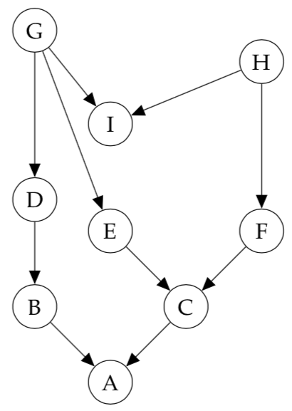
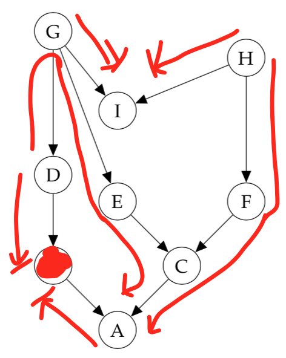
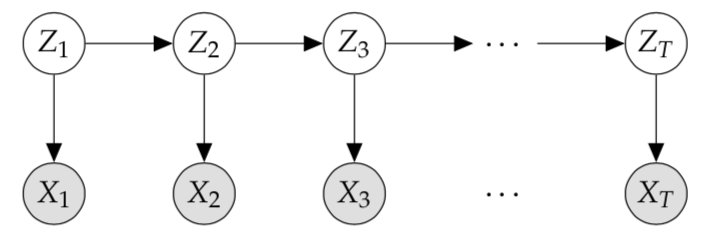

# Sample Midterm (Answers)

_Things to know for the midterm_

- Bayes' rule, sum and product rules of probability, expectations
- Conditioning, normalization, marginalization
- Exponential family distributions, maximum likelihood
- Logistic regression, Naive Bayes
- Converting graphical models to pdfs and back
- Determining conditional independence
- DAGs vs UGMs vs factor graphs
- Computational complexity of inference

!!! note
    Take this with a grain of salt. Appears to be a list given in the previous version of the course (we did not discuss logistic regression in lecture, for example).

## Question 1

Recall that the definition of an exponential family model is:

\[
f(x | \eta) = h(x)g(\eta)\exp(\eta^TT(x))
\]

where

- \(\eta\) are the parameters
- \(T(x)\) are the sufficient statistics
- \(h(x)\) is the base measure
- \(g(\eta)\) is the normalizing constant

Consider the univariate Gaussian, with mean \(\mu\) and precision \(\lambda = \frac{1}{\sigma^2}\)

\[
p(D | \mu \lambda) = \prod^N_{i=1}(\frac{\lambda}{2\pi})^{\frac{1}{2}}\exp(-\frac{\lambda}{2}(x_i - \mu)^2)
\]

What are \(\eta\) and \(T(x)\) for this distribution when represented in exponential family form?

__ANSWER__

Start by expanding the terms in the exponent

\[
= \prod^N_{i=1}(\frac{\lambda}{2\pi})^{\frac{1}{2}} \exp(\sum_{i=1}^N -\frac{\lambda}{2}x_i^2 + \lambda u x_i - \frac{\lambda}{2}\mu^2) \\
\]

from here, we can rearrange the exponent into \(\eta^TT(x)\)

\[
= \prod^N_{i=1}(\frac{\lambda}{2\pi})^{\frac{1}{2}}\exp(\sum_{i=1}^N - \frac{\lambda}{2}\mu^2)\exp(\begin{bmatrix}\lambda u & -\frac{\lambda}{2} & \dotsc & \lambda u & -\frac{\lambda}{2}\end{bmatrix} \begin{bmatrix}x_1 \\ x_1^2 \\ \vdots \\ x_N \\ x_N^2\end{bmatrix}) \\
\]

where

- \(\eta^T = \begin{bmatrix}\lambda u & -\frac{\lambda}{2} & \dotsc & \lambda u & -\frac{\lambda}{2}\end{bmatrix}\)
- \(T(x) = \begin{bmatrix}x_1 \\ x_1^2 \\ \vdots \\ x_N \\ x_N^2\end{bmatrix}\)

## Question 2

Consider the following directed graphical model:

(a) List all variables that are independent of \(A\) given evidence on \(B\)

By Bayes' Balls, no variables are conditionally independent of \(A\) given evidence on \(B\).

(b) Write down the factorized normalized joint distribution that this graphical model represents.

\[
p(A, ..., I) = p(A | B, C)P(B | D)P(C | E, F)P(D | G)P(E | G)P(F | H)P(G)P(H)P(I | G, H)
\]

(c) If each node is a single discrete random variable in \({1, ..., K}\) how many distinct joint states can the model take? That is, how many different configurations can the variables in this model be set?

For each node (random variable) there is \(k\) states. There are \(k^n\) possible configurations where \(k\) is the number of states and \(n\) the number of nodes (\(x_{\pi_i}\))

\[
\therefore \text{number of possible configurations} = k^9
\]

## Question 3

__ANSWER__

a) The size of the maximum factor is 3.
b) The size of the maximum clique is 3.
c) The size of the maximum factor is 4.
d) The size of the maximum clique is 4.

## Question 4

Consider the Hidden Markov Model

(a) Assume you are able to sample from these conditional distributions, i.e.

\[
x_i \sim p(X_i \ | \ \text{parents of } X_i)
\]

Write down a step-by-step process to produce a sample observation from this model, i.e. \((x_1, x_2, x_3, ..., x_T)\) in terms of samples from the individual factors.

__ANSWER__

We want to sample a sequence of observations \(x_1, x_2, x_3, ..., x_T\) from the model according to

\[
x_{1:T} \sim \prod_{t=1}^T p(X_t \ | \ \text{parents of } X_t)
\]

since observations \(x_t\) are independent of one another. Notice that this forms a chain, with probability

\[
p(x_{1:T}) \sim \bigg [ \prod_{t=1}^T p(X_t | z_t) \bigg ] \bigg [ p(z_1) \prod_{t=2}^T p(Z_t | z_{t-1}) \bigg ]
\]

_Step-by-step_

1. Start with \(t=1\)
2. Sample \(z_t\) according to \(z_t \sim p(z_1) \prod_{i=2}^t p(Z_i | z_{i-1})\)
3. Given the sampled \(z_t\), sample \(x_t\) according to \(x_t \sim \ p(X_t | z_t)\)
4. Increment \(t\) by 1
5. Repeat steps 2-4 until \(t=T\)
